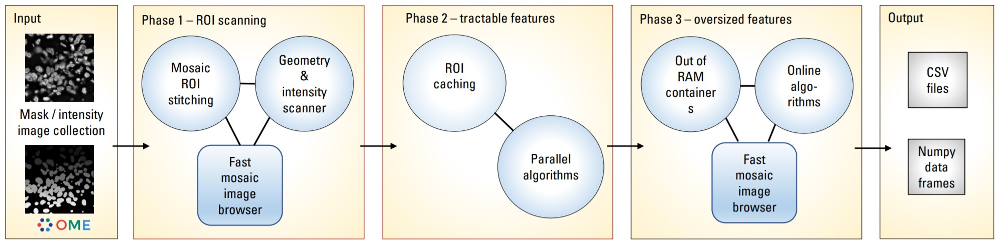

# Nyxus

A scalable library for calculating features from intensity-label image data

## Overview
Nyxus is a feature-rich, highly optimized, Python/C++ application capable of analyzing images of arbitrary size and assembling complex regions of interest (ROIs) split across multiple image tiles and files. This accomplished through multi-threaded tile prefetching and a three phase analysis pipeline shown below. 



Nyxus can be used via Python or command line and is available in containerized form for reproducible execution. Nyxus computes over 450 combined intensity, texture, and morphological features at the ROI or whole image level with more in development. Key features that make Nyxus unique among other image feature extraction applications is its ability to operate at any scale, its highly validated algorithms, and its modular nature that makes the addition of new features straightforward.

## Getting started 

For use in python, the latest version of Nyxus can be installed via the [Pip package manager](https://pypi.org/project/pip):

```
pip install nyxus
```

Usage is very straightforward. Given `intensities` and `labels` folders, Nyxus pairs up intensity-label pairs and extracts features from them. A summary of the avaialble feature are [listed below](#available-features).

```python 
from nyxus import Nyxus

intensity_path = "/path/to/images/intensities/"
labels_path = "/path/to/images/labels/"

nyx = Nyxus(["*ALL*"])

features = nyx.featurize(intensity_path, labels_path)
```

The `features` variable is a Pandas dataframe similar to what is shown below.

|     | mask_image           | intensity_image      |   label |    MEAN |   MEDIAN |...|    GABOR_6 |
|----:|:---------------------|:---------------------|--------:|--------:|---------:|--:|-----------:|
|   0 | p1_y2_r51_c0.ome.tif | p1_y2_r51_c0.ome.tif |       1 | 45366.9 |  46887   |...|   0.873016 |
|   1 | p1_y2_r51_c0.ome.tif | p1_y2_r51_c0.ome.tif |       2 | 27122.8 |  27124.5 |...|   1.000000 |
|   2 | p1_y2_r51_c0.ome.tif | p1_y2_r51_c0.ome.tif |       3 | 34777.4 |  33659   |...|   0.942857 |
|   3 | p1_y2_r51_c0.ome.tif | p1_y2_r51_c0.ome.tif |       4 | 35808.2 |  36924   |...|   0.824074 |
|   4 | p1_y2_r51_c0.ome.tif | p1_y2_r51_c0.ome.tif |       5 | 36739.7 |  37798   |...|   0.854067 |
| ... | ...                  | ...                  |     ... | ...     |  ...     |...|   ...      |
| 734 | p5_y0_r51_c0.ome.tif | p5_y0_r51_c0.ome.tif |     223 | 54573.3 |  54573.3 |...|   0.980769 |

For more information on all of the available options and features, check out [the documentation](#).

Nyxus can also be [built from source](#building-from-source) and used from the command line, or via a pre-built Docker container. 

## Available features 
The feature extraction plugin extracts morphology and intensity based features from pairs of intensity/binary mask images and produces a csv file output. The input image should be in tiled [OME TIFF format](https://docs.openmicroscopy.org/ome-model/6.2.0/ome-tiff/specification.html).  The plugin extracts the following features:

Nyxus provides a set of pixel intensity, morphology, texture, intensity distribution features, digital filter based features and image moments

------------------
| Nyxus feature code | Description |
|--------|-------|
| INTEGRATED_INTENSITY | Integrated intensity of the region of interest (ROI) |
| MEAN, MAX, MEDIAN, STANDARD_DEVIATION, MODE | Mean/max/median/stddev/mode intensity value of the ROI | 
| SKEWNESS, KURTOSIS, HYPERSKEWNESS, HYPERFLATNESS  | higher standardized moments | 
| MEAN_ABSOLUTE_DEVIATION  | Mean absolute devation | 
| ENERGY  | ROI energy | 
| ROOT_MEAN_SQUARED  | Root of mean squared deviation | 
| ENTROPY  | ROI entropy - a measure of the amount of information in the ROI | 
| UNIFORMITY  | Uniformity - measures how uniform the distribution of ROI intensities is | 
| UNIFORMITY_PIU  | Percent image uniformity, another measure of intensity distribution uniformity | 
| P01, P10, P25, P75, P90, P99  | 1%, 10%, 25%, 75%, 90%, and 99% percentiles of intensity distribution | 
| INTERQUARTILE_RANGE  | Distribution's interquartile range | 
| ROBUST_MEAN_ABSOLUTE_DEVIATION  | Robust mean absolute deviation | 
| MASS_DISPLACEMENT  | ROI mass displacement | 
| AREA_PIXELS_COUNT | ROI area in the number of pixels |
| COMPACTNESS  | Mean squared distance of the object’s pixels from the centroid divided by the area |
| BBOX_YMIN | Y-position and size of the smallest axis-aligned box containing the ROI |
| BBOX_XMIN | X-position and size of the smallest axis-aligned box containing the ROI |
| BBOX_HEIGHT | Height of the smallest axis-aligned box containing the ROI |
| BBOX_WIDTH | Width of the smallest axis-aligned box containing the ROI |
| MAJOR/MINOR_AXIS_LENGTH, ECCENTRICITY, ORIENTATION, ROUNDNESS | Inertia ellipse features |
| NUM_NEIGHBORS, PERCENT_TOUCHING | The number of neighbors bordering the ROI's perimeter and related neighbor methods |
| EXTENT | Proportion of the pixels in the bounding box that are also in the region |
| CONVEX_HULL_AREA | Area of ROI's convex hull |
| SOLIDITY | Ratio of pixels in the ROI common with its convex hull image |
| PERIMETER | Number of pixels in ROI's contour |
| EQUIVALENT_DIAMETER | Diameter of the circle having circumference equal to the ROI's perimeter |
| EDGE_MEAN/MAX/MIN/STDDEV_INTENSITY | Intensity statistics of ROI's contour pixels |
| CIRCULARITY | Represents how similar a shape is to circle. Clculated based on ROI's area and its convex perimeter |
| EROSIONS_2_VANISH | Number of erosion operations for a ROI to vanish in its axis aligned bounding box |
| EROSIONS_2_VANISH_COMPLEMENT | Number of erosion operations for a ROI to vanish in its convex hull |
| FRACT_DIM_BOXCOUNT, FRACT_DIM_PERIMETER | Fractal dimension features |
| GLCM | Gray level co-occurrence Matrix features |
| GLRLM | Gray level run-length matrix based features
| GLSZM | Gray level size zone matrix based features
| GLDM | Gray level dependency matrix based features
| NGTDM | Neighbouring gray tone difference matrix features
| ZERNIKE2D, FRAC_AT_D, RADIAL_CV, MEAN_FRAC | Radial distribution features
| GABOR | A set of Gabor filters of varying frequencies and orientations |

For the complete list of features see [Nyxus provided features](docs/featurelist.md)

## Feature groups

Apart from defining your feature set by explicitly specifying comma-separated feature code, Nyxus lets a user specify popular feature groups. Supported feature groups are:

------------------------------------
| Group code | Belonging features |
|--------------------|-------------|
| \*all_intensity\* | integrated_intensity, mean, median, min, max, range, standard_deviation, standard_error, uniformity, skewness, kurtosis, hyperskewness, hyperflatness, mean_absolute_deviation, energy, root_mean_squared, entropy, mode, uniformity, p01, p10, p25, p75, p90, p99, interquartile_range, robust_mean_absolute_deviation, mass_displacement
| \*all_morphology\* | area_pixels_count, area_um2, centroid_x, centroid_y, weighted_centroid_y, weighted_centroid_x, compactness, bbox_ymin, bbox_xmin, bbox_height, bbox_width, major_axis_length, minor_axis_length, eccentricity, orientation, num_neighbors, extent, aspect_ratio, equivalent_diameter, convex_hull_area, solidity, perimeter, edge_mean_intensity, edge_stddev_intensity, edge_max_intensity, edge_min_intensity, circularity
| \*basic_morphology\* | area_pixels_count, area_um2, centroid_x, centroid_y, bbox_ymin, bbox_xmin, bbox_height, bbox_width
| \*all_glcm\* | glcm_angular2ndmoment, glcm_contrast, glcm_correlation, glcm_variance, glcm_inversedifferencemoment, glcm_sumaverage, glcm_sumvariance, glcm_sumentropy, glcm_entropy, glcm_differencevariance, glcm_differenceentropy, glcm_infomeas1, glcm_infomeas2
| \*all_glrlm\* | glrlm_sre, glrlm_lre, glrlm_gln, glrlm_glnn, glrlm_rln, glrlm_rlnn, glrlm_rp, glrlm_glv, glrlm_rv, glrlm_re, glrlm_lglre, glrlm_hglre, glrlm_srlgle, glrlm_srhgle, glrlm_lrlgle, glrlm_lrhgle
| \*all_glszm\* | glszm_sae, glszm_lae, glszm_gln, glszm_glnn, glszm_szn, glszm_sznn, glszm_zp, glszm_glv, glszm_zv, glszm_ze, glszm_lglze, glszm_hglze, glszm_salgle, glszm_sahgle, glszm_lalgle, glszm_lahgle
| \*all_gldm\* | gldm_sde, gldm_lde, gldm_gln, gldm_dn, gldm_dnn, gldm_glv, gldm_dv, gldm_de, gldm_lgle, gldm_hgle, gldm_sdlgle, gldm_sdhgle, gldm_ldlgle, gldm_ldhgle
| \*all_ngtdm\* | ngtdm_coarseness, ngtdm_contrast, ngtdm_busyness, ngtdm_complexity, ngtdm_strength
| \*all_easy\* | All the features except the most time-consuming GABOR, GLCM, and the group of 2D moment features
| \*all\* | All the features 

## Command line usage

Assuming you [built the Nyxus binary](#building-from-source) as outlined below, the following parameters are available for the CLI:

| Parameter | Description | I/O | Type |
|------|-------------|------|----|
--intDir|Intensity image collection|Input|collection|
--segDir|Labeled image collection|Input|collection
--intSegMapDir | Data collection of the ad-hoc intensity-to-mask file mapping | Input | Collection
--intSegMapFile | Name of the text file containing an ad-hoc intensity-to-mask file mapping. The files are assumed to reside in corresponding intensity and label collections | Input | string
--features|Select intensity and shape features required|Input|array
--filePattern|To match intensity and labeled/segmented images |Input|string
--csvfile|Save csv file as one csv file for all images or separate csv file for each image|Input|enum
--pixelDistance|Pixel distance to calculate the neighbors touching cells|Input|integer|
--embeddedpixelsize|Consider the unit embedded in metadata, if present|Input|boolean
--unitLength|Enter the metric for unit conversion|Input|string
--pixelsPerunit|Enter the number of pixels per unit of the metric|Input|number
--outDir|Output collection|Output|csvCollection
--coarseGrayDepth|Custom number of levels in grayscale denoising used in texture features (default: 256)|Input|integer
---

### Example: Running Nyxus to process images of specific image channel

Suppose we need to process intensity/mask images of channel 1 :
```
./nyxus --features=*all_intensity*,*basic_morphology* --intDir=/home/ec2-user/data-ratbrain/int --segDir=/home/ec2-user/data-ratbrain/seg --outDir=/home/ec2-user/work/output-ratbrain --filePattern=.*_c1\.ome\.tif --csvFile=singlecsv 
```
### Example: Running Nyxus to process specific image 

Suppose we need to process intensity/mask file p1_y2_r68_c1.ome.tif :
```
./nyxus --features=*all_intensity*,*basic_morphology* --intDir=/home/ec2-user/data-ratbrain/int --segDir=/home/ec2-user/data-ratbrain/seg --outDir=/home/ec2-user/work/output-ratbrain --filePattern=p1_y2_r68_c1\.ome\.tif --csvFile=singlecsv 
```

### Example: Running Nyxus to extract only intensity and basic morphology features

```
./nyxus --features=*all_intensity*,*basic_morphology* --intDir=/home/ec2-user/data-ratbrain/int --segDir=/home/ec2-user/data-ratbrain/seg --outDir=/home/ec2-user/work/output-ratbrain --filePattern=.* --csvFile=singlecsv 
```

## Building from source
To build Nyxus from source, make sure you clone the Github repository with the `--recurse-submodules` option to clone all the necessary dependencies.

```
git clone --recurse-submodules https://github.com/PolusAI/nyxus.git
```

Nyxus relies on [libTIFF](http://www.libtiff.org) as an external dependency which is readily available on most Unix-based OSs via the system package manager. 

For Debian-based distros, such as Ubuntu, this can be installed via:

```bash
sudo apt install libtiff-dev
```

For CentOS:
```bash
sudo yum install libtiff-devel
```

For Mac OSX (via [Homebrew](https://brew.sh/)):
```bash
brew install libtiff
```

Nyxus uses a CMake build system.
```bash
cd nyxus
mkdir build
cd build
cmake -DBUILD_CLI=ON ..
make -j4
```

Note that `-DBUILD_CLI=ON` tells Nyxus to build the command line interface as well. 

## Running via Docker 
Running Nyxus from a local directory freshly made Docker container is a good idea. It allows one to test-run conteinerized Nyxus before it reaches Docker cloud deployment.

To search available Nyxus images run command 
```
docker search nyxus
```
and you'll be shown that it's available at least via organization 'polusai'. To pull it, run
```
docker pull polusai/nyxus
``` 

The following command line is an example of running the dockerized feature extractor (image hash 87f3b560bbf2) with only intensity features selected:
```
docker run -it --mount type=bind,source=/images/collections,target=/data 87f3b560bbf2 --intDir=/data/c1/int --segDir=/data/c1/seg --outDir=/data/output --filePattern=.* --csvfile=separatecsv --features=entropy,kurtosis,skewness,max_intensity,mean_intensity,min_intensity,median,mode,standard_deviation
```


### Install from sources and package into a Docker image

If you want to build your own Nyxus Docker container we provide a convenient shell script:

```
./build-docker.sh
```


## Dependencies
Nyxus is tested with Python 3.6+. Nyxus relies on the the following packages, which are all included as submodules except for LibTIFF:

[NIST Hedgehog](https://github.com/usnistgov/hedgehog) >= 1.0.16 <br>
[NIST Fastloader](https://github.com/usnistgov/FastLoader) >= 2.1.4 <br>
[pybind11](https://github.com/pybind/pybind11) >= 2.8.1 <br>
[libTIFF](http://www.libtiff.org) >= 3.6.1 <br>

## WIPP Usage

Nyxus is available as plugin for [WIPP](https://isg.nist.gov/deepzoomweb/software/wipp). 

__Label image collection:__
The input should be a labeled image in tiled OME TIFF format (.ome.tif). Extracting morphology features, Feret diameter statistics, neighbors, hexagonality and polygonality scores requires the segmentation labels image. If extracting morphological features is not required, the label image collection can be not specified.

__Intensity image collection:__
Extracting intensity-based features requires intensity image in tiled OME TIFF format. This is an optional parameter - the input for this parameter is required only when intensity-based features needs to be extracted.

__File pattern:__
Enter file pattern to match the intensity and labeled/segmented images to extract features (https://pypi.org/project/filepattern/) Filepattern will sort and process files in the labeled and intensity image folders alphabetically if universal selector(.*.ome.tif) is used. If a more specific file pattern is mentioned as input, it will get matches from labeled image folder and intensity image folder based on the pattern implementation.

__Pixel distance:__
Enter value for this parameter if neighbors touching cells needs to be calculated. The default value is 5. This parameter is optional.

__Features:__
Comma separated list of features to be extracted. If all the features are required, then choose option __*all*__.

__Csvfile:__
There are 2 options available under this category. __*Separatecsv*__ - to save all the features extracted for each image in separate csv file. __*Singlecsv*__ - to save all the features extracted from all the images in the same csv file.

__Embedded pixel size:__
This is an optional parameter. Use this parameter only if units are present in the metadata and want to use those embedded units for the features extraction. If this option is selected, value for the length of unit and pixels per unit parameters are not required.

__Length of unit:__
Unit name for conversion. This is also an optional parameter. This parameter will be displayed in plugin's WIPP user interface only when embedded pixel size parameter is not selected (ckrresponding check box checked).

__Pixels per unit:__
If there is a metric mentioned in Length of unit, then Pixels per unit cannot be left blank and hence the scale per unit value must be mentioned in this parameter. This parameter will be displayed in plugin's user interface only when embedded pixel size parameter is not selected.

__Note:__ If Embedded pixel size is not selected and values are entered in Length of unit and Pixels per unit, then the metric unit mentioned in length of unit will be considered.
If Embedded pixel size, Length of unit and Pixels per unit is not selected and the unit and pixels per unit fields are left blank, the unit will be assumed to be pixels.

__Output:__
The output is a csv file containing the value of features required.

For more information on WIPP, visit the [official WIPP page](https://github.com/usnistgov/WIPP/tree/master/user-guide).

## Nested features 

A separate command line executable "nyxushie" for the hierarchical ROI analysis by finding nested ROIs and aggregating features of child ROIs within corresponding parent features is available. Its command line format is:
```
nyxushie <segment image collection dir> <file pattern> <channel signature> <parent channel> <child channel> <features dir> [-aggregate=<aggregation method>]
```
where 

*\<segment image collection dir\>* is directory of the segment images collection ;

*\<file pattern\>* is a regular expression to filter files in \<segment image collection dir\> ;

*\<channel signature\>* is a signature of the channel part in an image file name ;

*\<parent channel\>* is an integer channel number where parent ROIs are expected ;

*\<child channel\>* is an integer channel number where child ROIs are expected ;

*\<features dir\>* is a directory used as the output of parent-child ROI relations and, if aggregation is requested, where CSV files of Nyxus features produced with Nyxus command line option --csvfile=separatecsv is located ;

(optional) *\<aggregation method\>* is a method instructing how to aggregate child ROI features under a parent ROI. 

Valid aggregation method options are: SUM, MEAN, MIN, MAX, or WMA (weighted mean average).

__Example__: we need to process collection of mask images located in directory "\~/data/image-collection1/seg" considering only images named "train_.*\\.tif" whose channel information begins with characters "\_ch" (\_ch0, \_ch1, etc.) telling Nyxushie to treat channel 1 images as source of parent ROIs and channel 0 images as source of child ROIs. The output directory needs to be "\~/results/result1". The command line will be
```
nyxushie ~/data/image-collection1/seg train_.*\\.tif _ch 1 0 ~/results/result1
```

Using the hierarchical ROI Python API is illustrated in the following example:
```
from nyxus import Nested
nyx = Nested()
segPath = "d:\\data\\mini\\seg"
fPat = '.*'
cnlSig = '_c'
parCnl = '1'
chiCnl = '0'
rels = nyx.findrelations (segPath, fPat, cnlSig, parCnl, chiCnl)
```

### Nested features Python API

The nested features functionality can also be utilized in Python using the `Nested` class in `nyxus`. The `Nested` class
contains two methods, `find_relations` and `featurize`. 

The `find_relations` method takes in a path to the label files, along with a child 
filepattern to identify the files in the child channel and a parent filepattern to match the files in the parent channel. The `find_relation` method 
returns a Pandas DataFrame containing a mapping between parent ROIS and the respective child ROIs.

The `featurize` method takes in the parent-child mapping along with the features of the ROIs in the child channel. If a list of aggregate functions
is provided to the constructor, this method will return a pivoted DataFrame where the rows are the ROI labels and the columns are grouped by the features.


__Example__: Using aggregate functions

``` python

from nyxus import Nyxus, Nested
import numpy as np

int_path = 'path/to/intensity'
seg_path = 'path/to/segmentation'

nyx = Nyxus(['GABOR'])

child_features = nyx.featurize(int_path, seg_path, file_pattern='p[0-9]_y[0-9]_r[0-9]_c0\.ome\.tif')

nest = Nested(['sum', 'mean', 'min', ('nanmean', lambda x: np.nanmean(x))])

df = nest.find_relations(seg_path, 'p{r}_y{c}_r{z}_c1.ome.tif', 'p{r}_y{c}_r{z}_c0.ome.tif')

df2 = nest.featurize(df, features)
```

The parent-child map is

``` bash
    Image              Parent_Label  Child_Label
    0  /path/to/image          72             65
    1  /path/to/image          71             66
    2  /path/to/image          70             64
    3  /path/to/image          68             61
    4  /path/to/image          67             65

```

and the aggregated DataFrame is 

``` bash
            GABOR_0                                  GABOR_1                                  GABOR_2              ... 
            sum        mean      min       nanmean    sum      mean       min       nanmean   sum      mean        ...
    label                                                                                                          ...                                                                                                      
     1      24.010227  0.666951  0.000000  0.666951  19.096262  0.530452  0.001645  0.530452  17.037345  0.473260  ... 
     2      13.374170  0.445806  0.087339  0.445806   7.279187  0.242640  0.075000  0.242640   6.390529  0.213018  ...  
     3       5.941783  0.198059  0.000000  0.198059   3.364149  0.112138  0.000000  0.112138   2.426409  0.080880  ...  
     4      13.428773  0.559532  0.000000  0.559532  12.021938  0.500914  0.008772  0.500914   9.938915  0.414121  ...  
     5       6.535722  0.181548  0.000000  0.181548   1.833463  0.050930  0.000000  0.050930   2.083023  0.057862  ...

```

__Example__: Without aggregate functions

``` python

from nyxus import Nyxus, Nested
import numpy as np

int_path = 'path/to/intensity'
seg_path = 'path/to/segmentation'

nyx = Nyxus(['GABOR'])

child_features = nyx.featurize(int_path, seg_path, file_pattern='p[0-9]_y[0-9]_r[0-9]_c0\.ome\.tif')

nest = Nested()

df = nest.find_relations(seg_path, 'p{r}_y{c}_r{z}_c1.ome.tif', 'p{r}_y{c}_r{z}_c0.ome.tif')

df2 = nest.featurize(df, features)
```

the parent-child map remains the same but the `featurize` result becomes

``` bash
                     GABOR_0                                                                ...    
    Child_Label       1          2         3         4         5    6    7    8    9    10  ...    
    label                                                                                   ...
    1            0.666951       NaN       NaN       NaN       NaN  NaN  NaN  NaN  NaN  NaN  ...     
    2                 NaN  0.445806       NaN       NaN       NaN  NaN  NaN  NaN  NaN  NaN  ...     
    3                 NaN       NaN  0.198059       NaN       NaN  NaN  NaN  NaN  NaN  NaN  ...     
    4                 NaN       NaN       NaN  0.559532       NaN  NaN  NaN  NaN  NaN  NaN  ...     
    5                 NaN       NaN       NaN       NaN  0.181548  NaN  NaN  NaN  NaN  NaN  ...

```