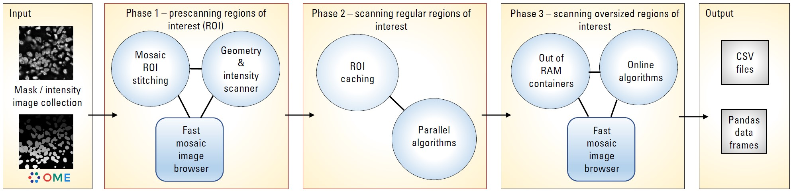

# Nyxus

[](https://nyxus.readthedocs.io/en/latest/)
[](https://pypi.org/project/nyxus/)
[](https://pypi.org/project/nyxus/)
[](https://anaconda.org/conda-forge/nyxus)
[](https://anaconda.org/conda-forge/nyxus)

A scalable library for calculating features from intensity-label image data

## Overview
Nyxus is a feature-rich, highly optimized, Python/C++ application capable of analyzing images of arbitrary size and assembling complex regions of interest (ROIs) split across multiple image tiles and files. This accomplished through multi-threaded tile prefetching and a three phase analysis pipeline shown below. 



Nyxus can be used via Python or command line and is available in containerized form for reproducible execution. Nyxus computes over 450 combined intensity, texture, and morphological features at the ROI or whole image level with more in development. Key features that make Nyxus unique among other image feature extraction applications is its ability to operate at any scale, its highly validated algorithms, and its modular nature that makes the addition of new features straightforward.

Currently, Nyxus can read image data from OME-TIFF, OME-Zarr and DICOM 2D Grayscale images. It also has a Python API to support in-memory image data via Numpy array. 

The docs can be found at [Read the Docs](https://nyxus.readthedocs.io/en/latest/).

## Getting started 

For use in python, the latest version of Nyxus can be installed via the [Pip package manager](https://pypi.org/project/pip) or [Conda package manager](https://docs.conda.io/en/latest/):

```
pip install nyxus
```

or 
```
conda install nyxus -c conda-forge
```

Usage is very straightforward. Given `intensities` and `labels` folders, Nyxus pairs up intensity-label images and extracts features from all of them. A summary of the avaialble feature are [listed below](#available-features).

```python 
from nyxus import Nyxus
nyx = Nyxus(["*ALL*"])
intensityDir = "/path/to/images/intensities/"
maskDir = "/path/to/images/labels/"
features = nyx.featurize_directory (intensityDir, maskDir)
```

Alternatively, Nyxus can process explicitly defined pairs of intensity-mask images thus specifying custom 1:N and M:N mapping between label and intensity image files. The following example extracts features from intensity images 'i1', 'i2', and 'i3' related with mask images 'm1' and 'm2' via a custom mapping:

```python 
from nyxus import Nyxus
nyx = Nyxus(["*ALL*"])
features = nyx.featurize_files(
    [
        "/path/to/images/intensities/i1.ome.tif", 
        "/path/to/images/intensities/i2.ome.tif",
        "/path/to/images/intensities/i3.ome.tif" 
    ], 
    [
        "/path/to/images/labels/m1.ome.tif", 
        "/path/to/images/labels/m2.ome.tif",
        "/path/to/images/labels/m2.ome.tif"
    ],
	False)
```

The `features` variable is a Pandas dataframe similar to what is shown below.

|     | mask_image           | intensity_image      |   label |    MEAN |   MEDIAN |...|    GABOR_6 |
|----:|:---------------------|:---------------------|--------:|--------:|---------:|--:|-----------:|
|   0 | p1_y2_r51_c0.ome.tif | p1_y2_r51_c0.ome.tif |       1 | 45366.9 |  46887   |...|   0.873016 |
|   1 | p1_y2_r51_c0.ome.tif | p1_y2_r51_c0.ome.tif |       2 | 27122.8 |  27124.5 |...|   1.000000 |
|   2 | p1_y2_r51_c0.ome.tif | p1_y2_r51_c0.ome.tif |       3 | 34777.4 |  33659   |...|   0.942857 |
|   3 | p1_y2_r51_c0.ome.tif | p1_y2_r51_c0.ome.tif |       4 | 35808.2 |  36924   |...|   0.824074 |
|   4 | p1_y2_r51_c0.ome.tif | p1_y2_r51_c0.ome.tif |       5 | 36739.7 |  37798   |...|   0.854067 |
| ... | ...                  | ...                  |     ... | ...     |  ...     |...|   ...      |
| 734 | p5_y0_r51_c0.ome.tif | p5_y0_r51_c0.ome.tif |     223 | 54573.3 |  54573.3 |...|   0.980769 |

Nyxus can also process intensity-mask pairs that are loaded as Numpy arrays using the `featurize` method. This method takes in either a single pair of 2D intensity-mask pairs
or a pair of 3D arrays containing 2D intensity and mask images. There is also two optional parameters to supply names to the resulting dataframe, . 

```python 
from nyxus import Nyxus
import numpy as np

nyx = Nyxus(["*ALL*"])

intens = np.array([
    [[1, 4, 4, 1, 1],
     [1, 4, 6, 1, 1],
     [4, 1, 6, 4, 1],
     [4, 4, 6, 4, 1]],
])

seg = np.array([
    [[1, 1, 1, 1, 1],
     [1, 1, 1, 1, 1],
     [0, 1, 1, 1, 1],
     [1, 1, 1, 1, 1]]
])

features = nyx.featurize(intens, seg)
```

The `features` variable is a Pandas dataframe similar to what is shown below.

|     | mask_image    | intensity_image | label | MEAN    |   MEDIAN |...|    GABOR_6 |
|----:|:--------------|:----------------|------:|--------:|---------:|--:|-----------:|
|   0 | Segmentation1 | Intensity1      |     1 | 45366.9 |  46887   |...|   0.873016 |
|   1 | Segmentation1 | Intensity1      |     2 | 27122.8 |  27124.5 |...|   1.000000 |
|   2 | Segmentation1 | Intensity1      |     3 | 34777.4 |  33659   |...|   0.942857 |
|   3 | Segmentation1 | Intensity1      |     4 | 35808.2 |  36924   |...|   0.824074 |
| ... | ...           | ...             |   ... | ...     |  ...     |...|   ...      |
|  14 | Segmentation2 | Intensity2      |     6 | 54573.3 |  54573.3 |...|   0.980769 |

Note that in this case, default names of virtual image files were provided for the `mask_image` and `intensity_image` columns. To override default names 'Intensity<k>' and 'Segmentation<k>' appearing in these columns, the optional arguments `intensity_names` and `label_names` are used by passing lists of names in. 
The length of the lists must be the same as the length of the mask and intensity arrays. The following example sets mask and intensity images in the output to desired values:

```python 
intens_names = ['int1', 'int2']
seg_names = ['seg1', 'seg2']
features = nyx.featurize(intens, seg, intens_name, seg_name)
```

The `features` variable will now use the custom names, as shown below

|     | mask_image       | intensity_image          | label | MEAN    |   MEDIAN |...|    GABOR_6 |
|----:|:-----------------|:-------------------------|------:|--------:|---------:|--:|-----------:|
|   0 | seg1 | int1      |     1 | 45366.9 |  46887   |...|   0.873016 |
|   1 | seg1 | int1      |     2 | 27122.8 |  27124.5 |...|   1.000000 |
|   2 | seg1 | int1      |     3 | 34777.4 |  33659   |...|   0.942857 |
|   3 | seg1 | int1      |     4 | 35808.2 |  36924   |...|   0.824074 |
| ... | ...              | ...                      |   ... | ...     |  ...     |...|   ...      |
|  14 | seg2 | int2      |     6 | 54573.3 |  54573.3 |...|   0.980769 |


For more information on all of the available options and features, check out [the documentation](#).

Nyxus can also be [built from source](#building-from-source) and used from the command line, or via a pre-built Docker container. 

## Getting and setting parameters of Nyxus

All parameters to configure Nyxus are available to set within the constructor. These parameters can also be updated after the object is created using the `set_params`
method. This method takes in keyword arguments where the key is a valid parameter in Nyxus and the value is the updated value for the paramter. For example, 
to update the `coarse_gray_depth` to 256 and the `gabor_f0` parameter to 0.1, the following can be done:

```python 
from nyxus import Nyxus
nyx = Nyxus(["*ALL*"])
intensityDir = "/path/to/images/intensities/"
maskDir = "/path/to/images/labels/"
features = nyx.featurize_directory (intensityDir, maskDir)
nyx.set_params(coarse_gray_depth=256, gabor_f0=0.1)
```

A list of valid parameters is included in the documentation for this method.

To get the values of the parameters in Nyxus, the `get_params` method is used. If no arguments are passed to this function, then a dictionary mapping all of the variable names to the respective value is returned. For example,

```python 
from nyxus import Nyxus
nyx = Nyxus(["*ALL*"])
intensityDir = "/path/to/images/intensities/"
maskDir = "/path/to/images/labels/"
features = nyx.featurize_directory (intensityDir, maskDir)
print(nyx.get_params())
```

will print the dictionary

```bash
{'coarse_gray_depth': 256, 
'features': ['*ALL*'], 
'gabor_f0': 0.1, 
'gabor_freqs': [1.0, 2.0, 4.0, 8.0, 16.0, 32.0, 64.0], 
'gabor_gamma': 0.1, 
'gabor_kersize': 16, 
'gabor_sig2lam': 0.8, 
'gabor_theta': 45.0, 
'gabor_thold': 0.025, 
'ibsi': 0, 
'n_loader_threads': 1, 
'n_feature_calc_threads': 4, 
'neighbor_distance': 5, 
'pixels_per_micron': 1.0}
```

There is also the option to pass arguments to this function to only receive a subset of parameter values. The arguments should be 
valid parameter names as string, separated by commas. For example,

```python 
from nyxus import Nyxus
nyx = Nyxus(["*ALL*"])
intensityDir = "/path/to/images/intensities/"
maskDir = "/path/to/images/labels/"
features = nyx.featurize_directory (intensityDir, maskDir)
print(nyx.get_params('coarse_gray_depth', 'features', 'gabor_f0'))
```
will print the dictionary

```python
{ 
  'coarse_gray_depth': 256, 
  'features': ['*ALL*'], 
  'gabor_f0': 0.1 
}
```

## Using Arrow for feature results

Nyxus provides the ability to get the results of the feature calculations in Arrow IPC and Parquet formats. Note that writing to Arrow is currently only supported by building from source and is not yet available in the PyPI wheels. It is recommended to use Conda for building with Arrow enabled.

 To create an Arrow IPC or Parquet file, use the `create_arrow_ipc_file()` and `create_parquet_file()` methods on a Nyxus object. For example,

```python
    from nyxus import Nyxus
    import numpy as np

    intens = np.array([
        [[1, 4, 4, 1, 1],
            [1, 4, 6, 1, 1],
            [4, 1, 6, 4, 1],
            [4, 4, 6, 4, 1]],
                    
        [[1, 4, 4, 1, 1],
            [1, 1, 6, 1, 1],
            [1, 1, 3, 1, 1],
            [4, 4, 6, 1, 1]],
        
        [[1, 4, 4, 1, 1],
            [1, 1, 1, 1, 1],
            [1, 1, 6, 1, 1],
            [1, 1, 6, 1, 1]],
        
        [[1, 4, 4, 1, 1],
            [1, 1, 1, 1, 1],
            [1, 1, 1, 1, 1],
            [1, 1, 6, 1, 1]],
    ])

    seg = np.array([
        [[1, 1, 1, 1, 1],
            [1, 1, 1, 1, 1],
            [1, 1, 1, 1, 1],
            [1, 1, 1, 1, 1]],
                    
        [[1, 1, 1, 1, 1],
            [1, 1, 1, 1, 1],
            [0, 1, 1, 1, 1],
            [1, 1, 1, 1, 1]],
        
        [[1, 1, 1, 0, 0],
            [1, 1, 1, 1, 1],
            [1, 1, 0, 1, 1],
            [1, 1, 1, 1, 1]],
                    
        [[1, 1, 1, 0, 0],
            [1, 1, 1, 1, 1],
            [1, 1, 1, 1, 1],
            [1, 1, 1, 1, 1]]
        
    ])

    nyx = Nyxus(["*ALL_INTENSITY*"])

    features = nyx.featurize(intens, seg)

    nyx.create_arrow_file()

    arrow_file_path = nyx.get_arrow_ipc_file()

    print(arrow_file_path)

```

The output is:

```bash
    out.arrow
```

Note that both of these methods have an optional argument for a path to be provided of where to write the file to. For example, `nyx.create_arrow_file('out/out.arrow')`. For Arrow IPC files, a memory mapping can be created to access the data without using additional memory. For example, using the same `intens` and `seg` data as before,

```python
    nyx = Nyxus(["*ALL_INTENSITY*"])

    features = nyx.featurize(intens, seg)

    nyx.create_arrow_file()

    arrow_array = nyx.get_arrow_memory_mapping()
```

This functionality is also available in the through the command line using the flag `--outputType`. If this flag is set to `--outputType=arrow` then the results will be written to an Arrow IPC file in the output directory and `--outputType=parquet` will write to a Parquet file.

## Available features 
The feature extraction plugin extracts morphology and intensity based features from pairs of intensity/binary mask images and produces a csv file output. The input image should be in tiled [OME TIFF format](https://docs.openmicroscopy.org/ome-model/6.2.0/ome-tiff/specification.html).  The plugin extracts the following features:

Nyxus provides a set of pixel intensity, morphology, texture, intensity distribution features, digital filter based features and image moments

------------------
| Nyxus feature code | Description |
|--------|-------|
| INTEGRATED_INTENSITY | Integrated intensity of the region of interest (ROI) |
| MEAN, MAX, MEDIAN, STANDARD_DEVIATION, MODE | Mean/max/median/stddev/mode intensity value of the ROI | 
| SKEWNESS, KURTOSIS, HYPERSKEWNESS, HYPERFLATNESS  | higher standardized moments | 
| MEAN_ABSOLUTE_DEVIATION  | Mean absolute devation | 
| ENERGY  | ROI energy | 
| ROOT_MEAN_SQUARED  | Root of mean squared deviation | 
| ENTROPY  | ROI entropy - a measure of the amount of information in the ROI | 
| UNIFORMITY  | Uniformity - measures how uniform the distribution of ROI intensities is | 
| UNIFORMITY_PIU  | Percent image uniformity, another measure of intensity distribution uniformity | 
| P01, P10, P25, P75, P90, P99  | 1%, 10%, 25%, 75%, 90%, and 99% percentiles of intensity distribution | 
| INTERQUARTILE_RANGE  | Distribution's interquartile range | 
| ROBUST_MEAN_ABSOLUTE_DEVIATION  | Robust mean absolute deviation | 
| MASS_DISPLACEMENT  | ROI mass displacement | 
| AREA_PIXELS_COUNT | ROI area in the number of pixels |
| COMPACTNESS  | Mean squared distance of the object’s pixels from the centroid divided by the area |
| BBOX_YMIN | Y-position and size of the smallest axis-aligned box containing the ROI |
| BBOX_XMIN | X-position and size of the smallest axis-aligned box containing the ROI |
| BBOX_HEIGHT | Height of the smallest axis-aligned box containing the ROI |
| BBOX_WIDTH | Width of the smallest axis-aligned box containing the ROI |
| MAJOR/MINOR_AXIS_LENGTH, ECCENTRICITY, ORIENTATION, ROUNDNESS | Inertia ellipse features |
| NUM_NEIGHBORS, PERCENT_TOUCHING | The number of neighbors bordering the ROI's perimeter and related neighbor methods |
| EXTENT | Proportion of the pixels in the bounding box that are also in the region |
| CONVEX_HULL_AREA | Area of ROI's convex hull |
| SOLIDITY | Ratio of pixels in the ROI common with its convex hull image |
| PERIMETER | Number of pixels in ROI's contour |
| EQUIVALENT_DIAMETER | Diameter of the circle having circumference equal to the ROI's perimeter |
| EDGE_MEAN/MAX/MIN/STDDEV_INTENSITY | Intensity statistics of ROI's contour pixels |
| CIRCULARITY | Represents how similar a shape is to circle. Clculated based on ROI's area and its convex perimeter |
| EROSIONS_2_VANISH | Number of erosion operations for a ROI to vanish in its axis aligned bounding box |
| EROSIONS_2_VANISH_COMPLEMENT | Number of erosion operations for a ROI to vanish in its convex hull |
| FRACT_DIM_BOXCOUNT, FRACT_DIM_PERIMETER | Fractal dimension features |
| GLCM | Grey level co-occurrence Matrix features |
| GLRLM | Grey level run-length matrix based features |
| GLDZM | Grey level distance zone matrix based features |
| GLSZM | Grey level size zone matrix based features |
| GLDM | Grey level dependency matrix based features |
| NGTDM | Neighbouring grey tone difference matrix features |
| ZERNIKE2D, FRAC_AT_D, RADIAL_CV, MEAN_FRAC | Radial distribution features |
| GABOR | A set of Gabor filters of varying frequencies and orientations |

For the complete list of features see [Nyxus provided features](docs/featurelist.md)

## Feature groups

Apart from defining your feature set by explicitly specifying comma-separated feature code, Nyxus lets a user specify popular feature groups. Supported feature groups are:

------------------------------------
| Group code | Belonging features |
|--------------------|-------------|
| \*all_intensity\* | integrated_intensity, mean, median, min, max, range, standard_deviation, standard_error, uniformity, skewness, kurtosis, hyperskewness, hyperflatness, mean_absolute_deviation, energy, root_mean_squared, entropy, mode, uniformity, p01, p10, p25, p75, p90, p99, interquartile_range, robust_mean_absolute_deviation, mass_displacement
| \*all_morphology\* | area_pixels_count, area_um2, centroid_x, centroid_y, weighted_centroid_y, weighted_centroid_x, compactness, bbox_ymin, bbox_xmin, bbox_height, bbox_width, major_axis_length, minor_axis_length, eccentricity, orientation, num_neighbors, extent, aspect_ratio, equivalent_diameter, convex_hull_area, solidity, perimeter, edge_mean_intensity, edge_stddev_intensity, edge_max_intensity, edge_min_intensity, circularity
| \*basic_morphology\* | area_pixels_count, area_um2, centroid_x, centroid_y, bbox_ymin, bbox_xmin, bbox_height, bbox_width
| \*all_glcm\* | glcm_asm, glcm_acor, glcm_cluprom, glcm_clushade, glcm_clutend, glcm_contrast, glcm_correlation, glcm_difave, glcm_difentro, glcm_difvar, glcm_dis, glcm_energy, glcm_entropy, glcm_hom1, glcm_hom2, glcm_id, glcm_idn, glcm_idm, glcm_idmn, glcm_infomeas1, glcm_infomeas2, glcm_iv, glcm_jave, glcm_je, glcm_jmax, glcm_jvar, glcm_sumaverage, glcm_sumentropy, glcm_sumvariance, glcm_variance
| \*all_glrlm\* | glrlm_sre, glrlm_lre, glrlm_gln, glrlm_glnn, glrlm_rln, glrlm_rlnn, glrlm_rp, glrlm_glv, glrlm_rv, glrlm_re, glrlm_lglre, glrlm_hglre, glrlm_srlgle, glrlm_srhgle, glrlm_lrlgle, glrlm_lrhgle
| \*all_glszm\* | glszm_sae, glszm_lae, glszm_gln, glszm_glnn, glszm_szn, glszm_sznn, glszm_zp, glszm_glv, glszm_zv, glszm_ze, glszm_lglze, glszm_hglze, glszm_salgle, glszm_sahgle, glszm_lalgle, glszm_lahgle
| \*all_gldm\* | gldm_sde, gldm_lde, gldm_gln, gldm_dn, gldm_dnn, gldm_glv, gldm_dv, gldm_de, gldm_lgle, gldm_hgle, gldm_sdlgle, gldm_sdhgle, gldm_ldlgle, gldm_ldhgle
| \*all_ngtdm\* | ngtdm_coarseness, ngtdm_contrast, ngtdm_busyness, ngtdm_complexity, ngtdm_strength
| \*all_easy\* | All the features except the most time-consuming GABOR, GLCM, and the group of 2D moment features
| \*all\* | All the features 

## Command line usage

Assuming you [built the Nyxus binary](#building-from-source) as outlined below, the following parameters are available for the command line interface:

| <div style="width:150px">Parameter</div> | Description | Type |
|------|-------------|------|
--outputType | Output type for feature values (speratecsv, singlecsv, arrow, parquet). Default value: '--outputType=separatecsv' | string constant
--features | String constant or comma-seperated list of constants requesting a group of features or particular feature. Default value: '--features=\*ALL\*' | string
--filePattern | Regular expression to match image files in directories specified by parameters '--intDir' and '--segDir'. To match all the files, use '--filePattern=.\*' | string
--intDir | Directory of intensity image collection | path
--outDir | Output directory | path
--segDir | Directory of labeled image collection | path
--coarseGrayDepth | (optional) Custom number of greyscale level bins used in texture features. Default: '--coarseGrayDepth=256' | integer
--glcmAngles | (optional) Enabled direction angles of the GLCM feature. Superset of values: 0, 45, 90, and 135. Default: '--glcmAngles=0,45,90,135' | list of integer constants
--intSegMapDir | (optional) Data collection of the ad-hoc intensity-to-mask file mapping. Must be used in combination with parameter '--intSegMapFile' | path
--intSegMapFile | (optional) Name of the text file containing an ad-hoc intensity-to-mask file mapping. The files are assumed to reside in corresponding intensity and label collections. Must be used in combination with parameter '--intSegMapDir' | string
--pixelDistance | (optional) Number of pixels to treat ROIs within specified distance as neighbors. Default value: '--pixelDistance=5' | integer
--pixelsPerCentimeter | (optional) Number of pixels in centimeter used by unit length-related features. Default value: 0 | real
--ramLimit | (optional) Amount of memory not to exceed by Nyxus, in megabytes. Default value: 50\% of available memory. Example: '--ramLimit=2000' to use 2,000 megabytes | integer
--reduceThreads | (optional) Number of CPU threads used on the feature calculation step. Default: '--reduceThreads=1' | integer
--skiproi | (optional) Skip ROIs having specified labels. Example: '--skiproi=image1.tif:2,3,4;image2.tif:45,56' | string
--tempDir | (optional) Directory used by temporary out-of-RAM objects. Default value: system temporary directory | path
--hsig | (optional) Channel signature Example: "--hsig=_c" to match images whose file names have channel info starting substring '_c' like in 'p0_y1_r1_c1.ome.tiff' | string
--hpar | (optional) Channel number that should be used as a provider of parent segments. Example: '--hpar=1' | integer
--hchi | (optional) Channel number that should be used as a provider of child segments. Example: '--hchi=0' | integer
--hag | (optional) Name of a method how to aggregate features of segments recognized as children of same parent segment. Valid options are 'SUM', 'MEAN', 'MIN', 'MAX', 'WMA' (weighted mean average), and 'NONE' (no aggregation, instead, same parent child segments will be laid out horizontally) | string

---

## Examples

<span style="color:blue">Example 1:</span> __Running Nyxus to process images of specific image channel__

Suppose we need to process intensity/mask images of channel 1 :
```    
./nyxus --features=*all_intensity*,*basic_morphology* --intDir=/path/to/intensity/images --segDir=/path/to/mask/images --outDir=/path/to/output --filePattern=.*_c1\.ome\.tif --outputType=singlecsv 
```
<span style="color:blue">Example 2:</span> __Running Nyxus to process specific image__

Suppose we need to process intensity/mask file p1_y2_r68_c1.ome.tif :
```
./nyxus --features=*all_intensity*,*basic_morphology* --intDir=/path/to/intensity/images --segDir=/path/to/mask/images --outDir=/path/to/output --filePattern=p1_y2_r68_c1\.ome\.tif --outputType=singlecsv 
```

<span style="color:blue">Example 3:</span> __Running Nyxus to extract only intensity and basic morphology features__

```
./nyxus --features=*all_intensity*,*basic_morphology* --intDir=/path/to/intensity/images --segDir=/path/to/mask/images --outDir=/path/to/output --filePattern=.* --outputType=singlecsv 
```

<span style="color:blue">Example 4:</span> __Skipping specified ROIs while extracting features__

Suppose we need to blacklist ROI labels 2 and 3 from the kurtosis feature extraction globally, in each image. The command line way to do that is using option __--skiproi__ :
```shell 
./nyxus --skiproi=2,3 --features=KURTOSIS --intDir=/path/to/intensity/images --segDir=/path/to/mask/images --outDir=/path/to/output --filePattern=.* --outputType=singlecsv 
```

As a result, the default feature extraction result produced without option --skiproi looking like

<pre>
          mask_image  intensity_image  label    KURTOSIS
0    p0_y1_r1_c0.tif  p0_y1_r1_c0.tif      1   -0.134216
1    p0_y1_r1_c0.tif  p0_y1_r1_c0.tif      2   -0.130024<b>
2    p0_y1_r1_c0.tif  p0_y1_r1_c0.tif      3   -1.259801
3    p0_y1_r1_c0.tif  p0_y1_r1_c0.tif      4   -0.934786</b>
4    p0_y1_r1_c0.tif  p0_y1_r1_c0.tif      5   -1.072111
..          ...             ...           ...      ...
</pre>

will start looking like 

<pre>
          mask_image  intensity_image  label    KURTOSIS
0    p0_y1_r1_c0.tif  p0_y1_r1_c0.tif      1   -0.134216
1    p0_y1_r1_c0.tif  p0_y1_r1_c0.tif      4   -0.934786
2    p0_y1_r1_c0.tif  p0_y1_r1_c0.tif      5   -1.072111
3    p0_y1_r1_c0.tif  p0_y1_r1_c0.tif      6   -0.347741
4    p0_y1_r1_c0.tif  p0_y1_r1_c0.tif      7   -1.283468
..          ...             ...           ...      ...
</pre>


Note the comma character separator <span style="background-color:lightgrey">&nbsp;&nbsp;<b>,</b>&nbsp;&nbsp;</span> in the blacklisted ROI label list.

If we need to blacklist ROI labels 15 and 16 only in image image421.tif ROI label 17 in image image422.tif, we can do it via a per-file blacklist :
```
./nyxus --skiproi=image421.tif:15,16;image421.tif:17 --features=KURTOSIS --intDir=/path/to/intensity/images --segDir=/path/to/mask/images --outDir=/path/to/output --filePattern=.* --outputType=singlecsv 
```
Note the colon character <span style="background-color:lightgrey">&nbsp;&nbsp;<b>:</b>&nbsp;&nbsp;</span> between the file name and  backlisted labels within this file and semicolon character separator <span style="background-color:lightgrey">&nbsp;&nbsp;<b>;</b>&nbsp;&nbsp;</span> of file blacklists.

<span style="color:blue">Example 5:</span> __Skipping specified ROIs while extracting features (via Python API)__

The Nyxus Python API equivalent of global ROI blacklisting is implemented by method __blacklist_roi(*string*)__ called before a call of method __featurize...()__, for example, labels 15, 16, and 17 can be globally blacklisted as follows:
```python
from nyxus import Nyxus
nyx = Nyxus(features=["KURTOSIS"])
nyx.blacklist_roi('15,16,17')
features = nyx.featurize_directory (intensity_dir="/path/to/intensity/images", label_dir="/path/to/mask/images", file_pattern=".*")
```

Similarly, per-file ROI blacklists are defined in a way similar to the command line interface:
```python
from nyxus import Nyxus
nyx = Nyxus(features=["KURTOSIS"])
nyx.blacklist_roi('p0_y1_r1_c0.ome.tif:15,16;p0_y1_r2_c0.ome.tif:17')
features = nyx.featurize_directory (intensity_dir="/path/to/intensity/images", label_dir="/path/to/mask/images", file_pattern=".*")
```

See also methods __clear_roi_blacklist()__ and __roi_blacklist_get_summary()__ .

## Nested ROIs 

Hierarchical ROI analysis in a form of finding ROIs nested geometrically as nested AABBs and aggregating features of child ROIs within corresponding parent is available as an optional extra step after the feature extraction of the whole image set is finished. To enable this step, all the command line options '--hsig', '--hpar', '--hchi', and '--hag' need to have non-blank valid values. 

Valid aggregation options are SUM, MEAN, MIN, MAX, WMA (weighted mean average), or NONE (no aggregation).

<span style="color:blue">Example 6:</span> __Processing an image set with nested ROI postprocessing__ 

```
nyxus --features=*ALL_intensity* --intDir=/path/to/intensity/images --segDir=/path/to/mask/images --outDir=/path/to/output/directory --filePattern=.* --outputType=separatecsv --reduceThreads=4 --hsig=_c --hpar=1 --hchi=0 --hag=WMA 
```

As a result, 2 additional CSV files will be produced for each mask image whose channel number matches the value of option '--hpar': file 

```
<imagename>_nested_features.csv
``` 

where features of the detected child ROIs are laid next to their parent ROIs on same lines and auxiliary file 

```
<imagename>_nested_relations.csv
``` 

serving as a relational table of  parent and child ROI labels within parent ROI channel image ```<imagename>```.

### Nested features Python API

The nested features functionality can also be utilized in Python using the `Nested` class in `nyxus`. The `Nested` class
contains two methods, `find_relations` and `featurize`. 

The `find_relations` method takes in a path to the label files, along with a child 
filepattern to identify the files in the child channel and a parent filepattern to match the files in the parent channel. The `find_relation` method 
returns a Pandas DataFrame containing a mapping between parent ROIs and the respective child ROIs.

The `featurize` method takes in the parent-child mapping along with the features of the ROIs in the child channel. If a list of aggregate functions
is provided to the constructor, this method will return a pivoted DataFrame where the rows are the ROI labels and the columns are grouped by the features.


__Example 7__: Using aggregate functions

``` python

from nyxus import Nyxus, Nested
import numpy as np

int_path = 'path/to/intensity'
seg_path = 'path/to/segmentation'

nyx = Nyxus(['GABOR'])

child_features = nyx.featurize(int_path, seg_path, file_pattern='p[0-9]_y[0-9]_r[0-9]_c0\.ome\.tif')

nest = Nested(['sum', 'mean', 'min', ('nanmean', lambda x: np.nanmean(x))])

df = nest.find_relations(seg_path, 'p{r}_y{c}_r{z}_c1.ome.tif', 'p{r}_y{c}_r{z}_c0.ome.tif')

df2 = nest.featurize(df, features)
```

The parent-child map is

``` bash
    Image              Parent_Label  Child_Label
    0  /path/to/image          72             65
    1  /path/to/image          71             66
    2  /path/to/image          70             64
    3  /path/to/image          68             61
    4  /path/to/image          67             65

```

and the aggregated DataFrame is 

``` bash
            GABOR_0                                  GABOR_1                                  GABOR_2              ... 
            sum        mean      min       nanmean    sum      mean       min       nanmean   sum      mean        ...
    label                                                                                                          ...                                                                                                      
     1      24.010227  0.666951  0.000000  0.666951  19.096262  0.530452  0.001645  0.530452  17.037345  0.473260  ... 
     2      13.374170  0.445806  0.087339  0.445806   7.279187  0.242640  0.075000  0.242640   6.390529  0.213018  ...  
     3       5.941783  0.198059  0.000000  0.198059   3.364149  0.112138  0.000000  0.112138   2.426409  0.080880  ...  
     4      13.428773  0.559532  0.000000  0.559532  12.021938  0.500914  0.008772  0.500914   9.938915  0.414121  ...  
     5       6.535722  0.181548  0.000000  0.181548   1.833463  0.050930  0.000000  0.050930   2.083023  0.057862  ...

```

<span style="color:blue">Example 8:</span> __Without aggregate functions__

``` python

from nyxus import Nyxus, Nested
import numpy as np

int_path = 'path/to/intensity'
seg_path = 'path/to/segmentation'

nyx = Nyxus(['GABOR'])

child_features = nyx.featurize(int_path, seg_path, file_pattern='p[0-9]_y[0-9]_r[0-9]_c0\.ome\.tif')

nest = Nested()

df = nest.find_relations(seg_path, 'p{r}_y{c}_r{z}_c1.ome.tif', 'p{r}_y{c}_r{z}_c0.ome.tif')

df2 = nest.featurize(df, features)
```

the parent-child map remains the same but the `featurize` result becomes

``` bash
                     GABOR_0                                                                ...    
    Child_Label       1          2         3         4         5    6    7    8    9    10  ...    
    label                                                                                   ...
    1            0.666951       NaN       NaN       NaN       NaN  NaN  NaN  NaN  NaN  NaN  ...     
    2                 NaN  0.445806       NaN       NaN       NaN  NaN  NaN  NaN  NaN  NaN  ...     
    3                 NaN       NaN  0.198059       NaN       NaN  NaN  NaN  NaN  NaN  NaN  ...     
    4                 NaN       NaN       NaN  0.559532       NaN  NaN  NaN  NaN  NaN  NaN  ...     
    5                 NaN       NaN       NaN       NaN  0.181548  NaN  NaN  NaN  NaN  NaN  ...

```

## Building from source

Nyxus can either be build inside a `conda` environment or independently outside of it. For the later case, we provide a script to make it easier to download and build all the necessary dependencies.

### __Inside Conda__
Nyxus uses a CMake build system. To build the command line interface, pass `-DBUILD_CLI=ON` in the `cmake` command. For building with GPU support, use `-DUSEGPU=ON` flag in the `cmake` command. Here are the few notes on building with GPU support.

* Currently, GPU builds on Mac OS is not supported. 
* Due to the limitation of CUDA Development toolkit, upto GCC 9.X versions can be used on Linux. 
* On Windows, we assume the correct version of CUDA toolkit and compiler is installed that is compatible with the Microsoft Visual Studio C++ compiler. 

Below is an example of how to build Nyxus inside a `conda` environment on Linux.

```bash
git clone https://github.com/PolusAI/nyxus.git
cd nyxus
conda install -y -c conda-forge --file ci-utils/envs/conda_cpp.txt --file ci-utils/envs/conda_linux_compiler.txt --file ci-utils/envs/conda_py.txt --file ci-utils/envs/conda_linux_gpu.txt
mkdir build
cd build
cmake -DBUILD_CLI=ON -DUSEGPU=ON -DCMAKE_PREFIX_PATH=$CONDA_PREFIX -DCMAKE_INSTALL_PREFIX=$CONDA_PREFIX ..
make -j4
```
If you are building on Mac or Windows, skip the dependencies from `ci-utils/envs/conda_linux_compiler.txt` and `ci-utils/envs/conda_linux_gpu.txt`

To install the python package in the `conda` environment on Linux, use the following direction.
```bash
git clone https://github.com/PolusAI/nyxus.git
cd nyxus
conda install -y -c conda-forge --file ci-utils/envs/conda_cpp.txt --file ci-utils/envs/conda_linux_compiler.txt --file ci-utils/envs/conda_linux_gpu.txt --file ci-utils/envs/conda_py.txt
CMAKE_ARGS=" -DBUILD_CLI=ON -DUSEGPU=ON -DCMAKE_PREFIX_PATH=$CONDA_PREFIX -DCMAKE_INSTALL_PREFIX=$CONDA_PREFIX " python setup.py install
```

We also provide an example script that downloads `conda`, installs the necessary dependencies and then builds both the CLI and the python library on Linux. To run the script, do the following.
```bash
git clone https://github.com/PolusAI/nyxus.git
cd nyxus/ci-utils
./build_conda.sh ..
```
### __Without Using Conda__
To build Nyxus outside of a `conda` environment, use the following example.
```bash
git clone https://github.com/PolusAI/nyxus.git
cd nyxus
mkdir build
cd build
bash ../ci-utils/install_prereq_linux.sh
cmake -DBUILD_CLI=ON -DUSEGPU=ON -DCMAKE_PREFIX_PATH=./local_install -DCMAKE_INSTALL_PREFIX=./local_install ..
make -j4
```

## Running via Docker 
Running Nyxus from a local directory freshly made Docker container is a good idea. It allows one to test-run conteinerized Nyxus before it reaches Docker cloud deployment.

To search available Nyxus images run command 
```
docker search nyxus
```
and you'll be shown that it's available at least via organization 'polusai'. To pull it, run
```
docker pull polusai/nyxus
``` 

The following command line is an example of running the dockerized feature extractor (image hash 87f3b560bbf2) with only intensity features selected:
```
docker run -it [--gpus all] --mount type=bind,source=/images/collections,target=/data 87f3b560bbf2 --intDir=/data/c1/int --segDir=/data/c1/seg --outDir=/data/output --filePattern=.* --outputType=separatecsv --features=entropy,kurtosis,skewness,max_intensity,mean_intensity,min_intensity,median,mode,standard_deviation
```

### Install from sources and package into a Docker image

If you want to build your own Nyxus Docker container we provide a convenient shell script:

```
./ci-utils/build-docker.sh
```


## Dependencies
Nyxus is tested with Python 3.6+. Nyxus relies on the the following packages:

[pybind11](https://github.com/pybind/pybind11) >= 2.8.1 <br>
[libTIFF](http://www.libtiff.org) >= 3.6.1 <br>
[Z5](https://github.com/constantinpape/z5) >=2.0.15 <br>

Each of these dependencies also have hierarchical dependencies and so we recommend using the `conda` build system when building from source.

## WIPP Usage

Nyxus is available as plugin for [WIPP](https://isg.nist.gov/deepzoomweb/software/wipp). 

__Label image collection:__
The input should be a labeled image in tiled OME TIFF format (.ome.tif). Extracting morphology features, Feret diameter statistics, neighbors, hexagonality and polygonality scores requires the segmentation labels image. If extracting morphological features is not required, the label image collection can be not specified.

__Intensity image collection:__
Extracting intensity-based features requires intensity image in tiled OME TIFF format. This is an optional parameter - the input for this parameter is required only when intensity-based features needs to be extracted.

__File pattern:__
Enter file pattern to match the intensity and labeled/segmented images to extract features (https://pypi.org/project/filepattern/) Filepattern will sort and process files in the labeled and intensity image folders alphabetically if universal selector(.*.ome.tif) is used. If a more specific file pattern is mentioned as input, it will get matches from labeled image folder and intensity image folder based on the pattern implementation.

__Pixel distance:__
Enter value for this parameter if neighbors touching cells needs to be calculated. The default value is 5. This parameter is optional.

__Features:__
Comma separated list of features to be extracted. If all the features are required, then choose option __*all*__.

__Outputtype:__
There are 4 options available under this category. __*Separatecsv*__ - to save all the features extracted for each image in separate csv file. __*Singlecsv*__ - to save all the features extracted from all the images in the same csv file. __*Arrow*__ - to save all the features extracted from all the images in Apache Arrow format. __*Parquet*__ - to save all the features extracted from all the images in Apache Parquet format

__Embedded pixel size:__
This is an optional parameter. Use this parameter only if units are present in the metadata and want to use those embedded units for the features extraction. If this option is selected, value for the length of unit and pixels per unit parameters are not required.

__Length of unit:__
Unit name for conversion. This is also an optional parameter. This parameter will be displayed in plugin's WIPP user interface only when embedded pixel size parameter is not selected (ckrresponding check box checked).

__Pixels per unit:__
If there is a metric mentioned in Length of unit, then Pixels per unit cannot be left blank and hence the scale per unit value must be mentioned in this parameter. This parameter will be displayed in plugin's user interface only when embedded pixel size parameter is not selected.

__Note:__ If Embedded pixel size is not selected and values are entered in Length of unit and Pixels per unit, then the metric unit mentioned in length of unit will be considered.
If Embedded pixel size, Length of unit and Pixels per unit is not selected and the unit and pixels per unit fields are left blank, the unit will be assumed to be pixels.

__Output:__
The output is a csv file containing the value of features required.

For more information on WIPP, visit the [official WIPP page](https://github.com/usnistgov/WIPP/tree/master/user-guide).

