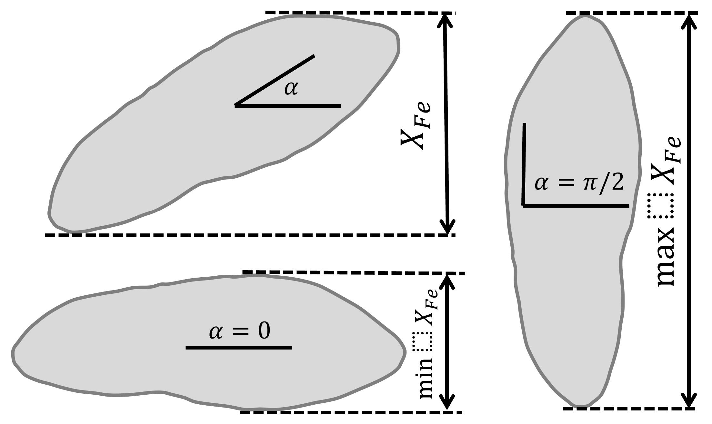
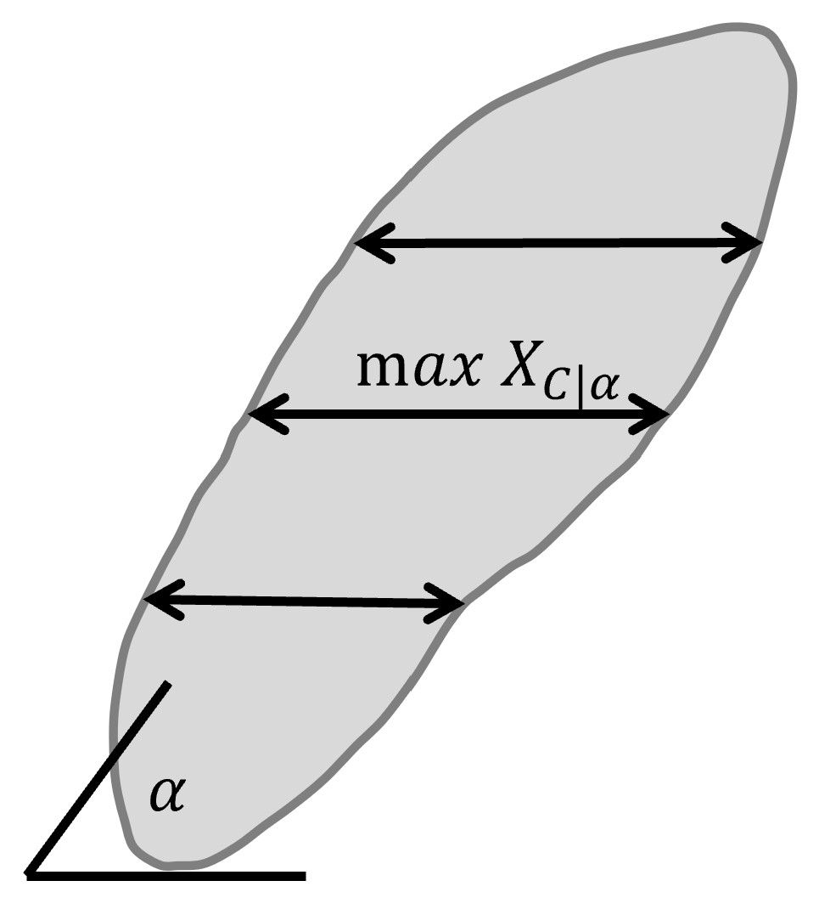

# Morphology features

Let:
$A$ be a set of $Np$ pixels included in the ROI

AREA_PIXELS_COUNT $= S = card(A)$

AREA_UM2 $= card(A) s^2$ where $s$ is pixel size in micrometers 

CENTROID_X $\gets c_X = \frac{1}{n} \sum _i ^n  A_{Xi} $

CENTROID_Y $\gets c_Y =  \frac{1}{n} \sum _i ^n  A_{Yi} $

WEIGHTED_CENTROID_X $\gets w_X = \frac{1}{n} \sum _i ^n  A_i (A_{Xi}-c_X)$

WEIGHTED_CENTROID_Y $= \frac{1}{n} \sum _i ^n  A_i (A_{Yi}-c_Y) \to w_Y$

MASS_DISPLACEMENT $= \sqrt {( w_X - c_X)^2 + ( w_Y - c_Y)^2}$

COMPACTNESS $= \frac {1}{n} \displaystyle {\sqrt {\operatorname {E} \left[(A-(c_X,c_Y)) )^{2}\right]}} $

BBOX_YMIN $\gets \epsilon_X = \operatorname {min}A_Y $

BBOX_XMIN $\gets \epsilon_Y = \operatorname {min}A_X $

BBOX_HEIGHT $\gets \epsilon_V = \operatorname {max}A_Y - \epsilon_Y$

BBOX_WIDTH $\gets \epsilon_H = \operatorname {max}A_X - \epsilon_X$

ASPECT_RATIO $\displaystyle =
\left\{\begin{array}{cc} 
\frac{\epsilon_V}{\epsilon_H} & \epsilon_V>=\epsilon_H \\
\frac{\epsilon_H}{\epsilon_V} & \epsilon_V<\epsilon_H 
\end{array}\right.
$ 

EXTENT $= \frac {S}{S_{BB}}$ where $S_BB=\epsilon_H\epsilon_V$

## Features related to ROI's contour

Let $C$ be the set of contour pixels of ROI $A$. 

PERIMETER $\displaystyle \gets P = card(C)$ 

CIRCULARITY $\displaystyle =\sqrt { \frac {4 \pi S}{P^2}}$ where $S$ and $P$ are ROI area and perimeter (features AREA_PIXELS_COUNT and PERIMETER)

EQUIVALENT_DIAMETER $\displaystyle = \frac {P}{\pi}$

EDGE_MEAN_INTENSITY $\displaystyle \gets \mu_C =\frac{1}{card(C)}\sum_i C_i$

EDGE_MAX_INTENSITY $= max \: \textrm C$

EDGE_MIN_INTENSITY $= min \: \textrm C$

EDGE_STDDEV_INTENSITY $\displaystyle = \left[\frac{1}{card(C)}\sum_i (C_i-\mu_C)^2\right]^{\frac {1}{2}}$

EDGE_INTEGRATEDINTENSITY $\displaystyle = \sum _i {C_i}$ 

## Features related to ROI's convex hull
CONVEX_HULL_AREA $=S_H=\displaystyle {\frac {1}{2}}{\Biggl \vert }\sum _{i=0}^{n_H-1}(x_{i}y_{i+1}-x_{i+1}y_{i}){\Biggr \vert }$ where $n_H$ is the number of convex hull vertices, $\displaystyle {(x_i,y_i)}, i=0, 1, ..., n_H-1$ are Cartesian coordinates of the vertives.

SOLIDITY $\displaystyle = \frac {S}{S_H}$ where $S$ is ROI area (feature AREA_PIXELS_COUNT)

## Features related to interpreting ROI pixels as a sampled ellipse

MAJOR_AXIS_LENGTH $= a = 4 \sqrt {\lambda_1}$ where $\lambda_1$ is the first largest principal component 

MINOR_AXIS_LENGTH $= b = 4 \sqrt {\lambda_2}$ where $\lambda_2$ is the second largest principal component 

ECCENTRICITY $= \displaystyle \sqrt {1 - \frac {b^2} {a^2}}$

ELONGATION $= \displaystyle \sqrt{\frac{\lambda_2}{\lambda_1}}$

ORIENTATION 
$\displaystyle \theta =
\left\{\begin{array}{cc} 
0 & b=0 \:\text{and}\: a \ge c \\
\frac{\pi}{2} & b=0 \:\text{and}\: a < c \\
\arctg \frac{\lambda_1-a}{b} & b \ne 0
\end{array}\right.
$ 
where 
$$
cov = \left(\begin{array}{cc} 
a & b\\
b & c
\end{array}\right)
- \text {covariance matrix of ROI pixel coordinates}
$$
and 
$\displaystyle \lambda_1 = \frac{a+c}{2}+\sqrt{(\frac{a-c}{2})^2 + b^2}$, $\displaystyle \lambda_2 = \frac{a+c}{2}-\sqrt{(\frac{a-c}{2})^2 + b^2}$

ROUNDNESS $\displaystyle = \frac {4 S}{\pi a b} $

## Neighbor features
NUM_NEIGHBORS $\gets n_N=$ the number of neighbor ROIs 

PERCENT_TOUCHING - the ratio of ROIs situated at Euclidean distance 0 to $n_N$

CLOSEST_NEIGHBOR1_DIST - distance to ROI's closest neighbor

CLOSEST_NEIGHBOR1_ANG - angle between the ROI centroid and its closest neighbor's centroid

CLOSEST_NEIGHBOR2_DIST - distance to ROI's 2nd closest neighbor

CLOSEST_NEIGHBOR2_ANG - angle between the ROI centroid and its 2nd closest neighbor's centroid

ANG_BW_NEIGHBORS_MEAN - standard deviation of the angle between ROI's neighbors.

ANG_BW_NEIGHBORS_STDDEV - standard deviation of the angle between ROI's neighbors.

ANG_BW_NEIGHBORS_MODE - the histogram bin value of angle between ROI's neighbors having the highest count.

## Polygonal representation features

POLYGONALITY_AVE $\displaystyle = 5 (r_S + r_A)$ where $\displaystyle r_S = 1 - \left|1-\frac{\frac{P}{n_N}}{\sqrt{\frac{4S\tg \frac{\pi}{n_N}}{n_N}}} \right|$ - polygonal size ratio, $\displaystyle r_A = 1 - \left| 1 - \frac{S\tg \frac{\pi}{n_N}}{\frac{1}{4} \: n_N \: P^2}\right|$ - polygonal area ratio, $n_N$ - number of ROI's neighbors, $P$ and $S$ - ROI's perimeter and area.

HEXAGONALITY_AVE $\displaystyle = \sqrt {\frac {r_{\sigma A}^2 + r_{\sigma P}^2}{2} }$

HEXAGONALITY_STDDEV $\displaystyle = 5 (r_{HS} + r_{HP})$

## Other features

DIAMETER_MIN_ENCLOSING_CIRCLE minimum diameter of a circle which completely covers the ROI

DIAMETER_CIRCUMSCRIBING_CIRCLE the smallest circle centered at the ROI centroid that totally encloses the profile,

DIAMETER_INSCRIBING_CIRCLE maximum diameter of a circle centered at the ROI centroid which fits inside the ROI

Let $l_G$ - geodetic length, $t_G$ - thickness. Assuming
$$\displaystyle 
\left\{\begin{array}{cc} 
S = l_G t_G \\
P = 2(l_G+t_G)
\end{array}\right.
$$ 
we can express the following features as:

GEODETIC_LENGTH $\displaystyle \gets l_G = \frac{P}{4} + \sqrt{\max \left(\frac{P^2}{16}-S, 0\right)}$

THICKNESS $\displaystyle \gets t_G = \frac{P}{2} - l_G$

Let $O=o_X,o_Y$ be the ROI centroid and $OC_i$ - segment connecting centroid to an edge pixel $i$. Then

ROI_RADIUS_MEAN $\displaystyle \gets \mu_r =\frac{1}{card(C)}\sum_i ||OC_i||$

ROI_RADIUS_MAX $\displaystyle = \max OC_i$

ROI_RADIUS_MEDIAN - median radius $OC_i$

## Caliper features

### Feret diameter

MIN_FERET_DIAMETER - minimum $X_{Fe}$ \
MAX_FERET_DIAMETER - maximum $X_{Fe}$ \
MIN_FERET_ANGLE - rotation angle delivering $\min X_{Fe}$ \
MAX_FERET_ANGLE - rotation angle delivering $\max X_{Fe}$

Statistics of Feret diameter at 0-90 degree rotation angles:
STAT_FERET_DIAM_MIN $=\min X_{Fe}$\
STAT_FERET_DIAM_MAX $=\max X_{Fe}$\
STAT_FERET_DIAM_MEAN $=\operatorname {E} ( X_{Fe} )$\
STAT_FERET_DIAM_MEDIAN\
STAT_FERET_DIAM_STDDEV\
STAT_FERET_DIAM_MODE

### Martin diameter

Statistics of Martin diameter at 0-90 degree rotation angles:
STAT_MARTIN_DIAM_MIN\
STAT_MARTIN_DIAM_MAX\
STAT_MARTIN_DIAM_MEAN\
STAT_MARTIN_DIAM_MEDIAN\
STAT_MARTIN_DIAM_STDDEV\
STAT_MARTIN_DIAM_MODE

### Nassenstein diameter

Statistics of Nassenstein diameter at 0-90 degree rotation angles:
STAT_NASSENSTEIN_DIAM_MIN\
STAT_NASSENSTEIN_DIAM_MAX\
STAT_NASSENSTEIN_DIAM_MEAN\
STAT_NASSENSTEIN_DIAM_MEDIAN\
STAT_NASSENSTEIN_DIAM_STDDEV\
STAT_NASSENSTEIN_DIAM_MODE

### All-chords features

ALLCHORDS_MAX\
ALLCHORDS_MAX_ANG\
ALLCHORDS_MIN\
ALLCHORDS_MIN_ANG\
ALLCHORDS_MEDIAN\
ALLCHORDS_MEAN\
ALLCHORDS_MODE\
ALLCHORDS_STDDEV

### Max-chord features
MAXCHORDS_MAX\
MAXCHORDS_MAX_ANG\
MAXCHORDS_MIN\
MAXCHORDS_MIN_ANG\
MAXCHORDS_MEDIAN\
MAXCHORDS_MEAN\
MAXCHORDS_MODE\
MAXCHORDS_STDDEV

