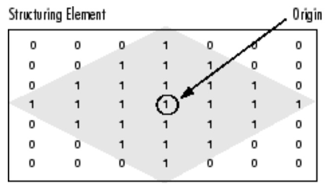

Erosion features
================

These features use the morphological erosion of the binary ROI image with respect to the :math:`3 \times 3` structuring element ker. The input ROI image is in the form of an image matrix.

A structuring element is a matrix that identifies the pixel in the image being processed and defines the neighborhood used in the processing of each pixel. For example, the following illustrates the origin of a diamond-shaped structuring element: 

    Figure from www.mathworks.com

EROSIONS_2_VANISH
-----------------

This feature calculates the number of erosion operations on a ROI to vanish in its axis aligned bounding box in a sense that each pixel intensity becomes :math:`=0`.

EROSIONS_2_VANISH_COMPLEMENT
----------------------------

Unlike EROSIONS_2_VANISH which is measured with respect to a ROI's axis aligned bounding box, his feature calculates the number of erosion operations on a ROI to vanish in its convex hull.
