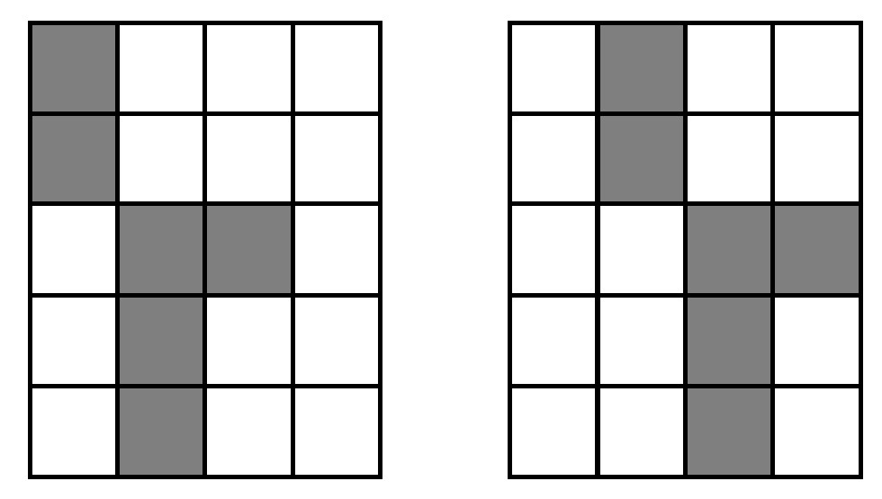
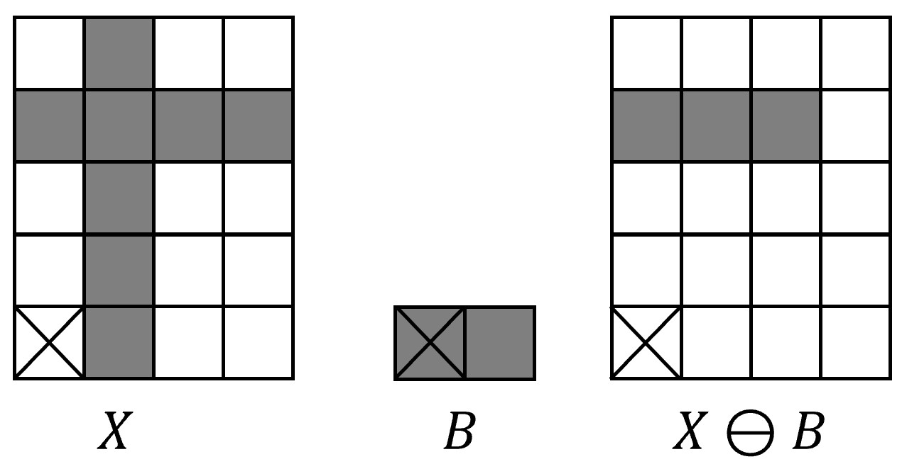
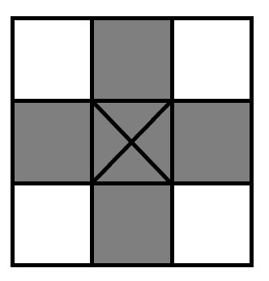

Erosion features
================

A morphological transformation T of an image (point set) A in 2-dimensional Euclidean space :math:`\mathbb{E}^2` by a smaller image (point set of smaller cardinality) B can be formulated in terms of a relation of the point set A with so called structuring element B. 
The application of morphological transformation T(A) means that the structuring element moves systematically across the entire set A with respect to a local origin.

Define translation :math:`X_h` of point set :math:`X` by a vector :math:`h` as 

.. math::
    X_h = \{ p \in \mathbb{E}^2, p=x+h \text{ for some } x \in X \}

    Translation of X by h

The erosion operation combines two point sets by Minkowski set subtraction [1]. 

.. math::
    X \ominus B = \{ p \in \mathbb{E}^2: p+b \in X \| b \in B \}

that is equivalent to taking the minkowski sum of a shape and the mirror of another shape.

every point :math:`p` from the image is tested, and the result of the erosion is given by those pixels :math:`p` for which all possible :math:`p + b` are in :math:`X`. Erosion can be expressed as an intersection of all translations of the image
:math:`X` by the vectors :math:`−b \in B` :  

.. math::
    X \ominus B = \bigcap_{b \in B} X_{−b}.

Example: given point sets 

.. math::
    X = \{ (1, 0),(1, 1),(1, 2),(0, 3),(1, 3),(2, 3),(3, 3),(1, 4) \}

and 

.. math::
    B = {(0, 0),(1, 0)} 

the result of erosion will be 

.. math::
    X \ominus B = {(0,3),(1,3),(2,3)}

    Erosion of X with structuring element B

Nyxus structuring element
-------------------------

By default, Nyxus uses the :math:`3 \times 3` structuring element in the erosion operations. 

    Default Nyxus structuring element

EROSIONS_2_VANISH
-----------------

This feature calculates the number of erosion operations on a ROI to vanish in its axis aligned bounding box in a sense that each pixel intensity becomes :math:`=0`.

    Example: 5 erosion operations applied to a star-shaped ROI

EROSIONS_2_VANISH_COMPLEMENT
----------------------------

Unlike EROSIONS_2_VANISH which is measured with respect to a ROI's axis aligned bounding box, this feature calculates the number of erosion operations on a ROI to vanish in its convex hull.

References
----------

1. Hadwiger, H. (1957) Vorlesungen uber Inhalt, Oberflache und isoperimetrie. Springer Verlag, Berlin. http://dx.doi.org/10.1007/978-3-642-94702-5