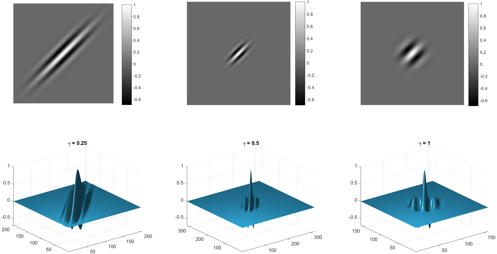

Gabor features
=======================

The idea behind Gabor feature calculation is filtering an image with an oriented texture element and treating a statistics
calculated over pixels of the filter response image as a measure of the texture element's abundance in the image. A set of :math:`k`
texture elements with unique calibrated direction and spatial frequency, called Gabor filter bank, is used to calculate a :math:`k` -dimensional feature vector
serving as a discriminating descriptor of the whole image.
To dampen the bias of varying intensity range in an image, its feature vector is normalized with respect to a feature vector
of an image produced with a equalizing filter.

Let :math:`I(x,y)` be a real valued 2D image intensity function at Cartesian location :math:`(x,y)` .
The oriented texture element is defined as a kernel of Gabor filter at location :math:`(x,y)`.
A Gabor kernel defined on a 2D domain of size :math:`n \times n` is a product of Gaussian factor :math:`g`
and harmonic factor :math:`f` :

.. math::
    h(x, y, \lambda, \theta, \psi, \sigma, \gamma) = g(x',y',\gamma,\sigma) \ f(x',\lambda,\psi) \\
    = exp \Big(-\frac {x'^2+\gamma^2 y'^2} {2\sigma^2} \Big) \ exp \Big[ i \Big( \frac {2 \pi x'}{\lambda} + \psi \Big) \Big]

where :math:`x,y \in \overline{1,n}`, :math:`x' = x \ \cos \ \theta + y \ \sin \ \theta` and :math:`y' = -x \ sin \ \theta + y \ cos \ \theta` .

:math:`\sigma` is standard deviation of the Gaussian factor :math:`g` playing the role of bandwidth controlling the overall size of the Gabor envelope.
Larger bandwidth values increase the envelope allowing more periodic ridges while smaller values result in fewer ridges.

:math:`\theta` is the angle of orientation of the normal to the major axis of the Gabor envelope.
:math:`\theta=0` corresponds to the vertical position of ridges of the harmonic factor.

:math:`\gamma` is the aspect ratio of the Gaussian factor :math:`g`.

The effect of varying :math:`\gamma` at :math:`\theta=\frac{3}{4}\pi` is shown below:

|
Parameters :math:`\lambda` and :math:`\psi` are the wavelength and phase shift of complex harmonic factor

.. math::
    f = exp \Big[ i(\frac {2 \pi x'}{\lambda} + \psi) \Big]

or equivalently

.. math::
    Re(f) = cos \Big[ 2 \pi (\frac {2 \pi x'}{\lambda} + \psi) \Big] \\
    Im(f) = sin \Big[ 2 \pi (\frac {2 \pi x'}{\lambda} + \psi) \Big]

In Nyxus implementation of the Gabor feature, parameters :math:`\lambda` and :math:`\sigma` are coupled
in the form of parameter "sig2lam" playing the role of spatial bandwidth:

.. math::
    \textrm{sig2lam} = \frac {\sigma} {\lambda}

Tuning Gabor feature parameters is advised to start with tuning :math:`\frac {\sigma} {\lambda}`.
There are multiple approaches to the tuning, for example, one based on maximizing the signal to noise ratio
of the filter response image :math:`R(x,y)` :

.. math::
    \textrm{SNR} = - \Big( \frac {\mu_R} {\sigma_R} \Big) ^2

where :math:`\mu_R` and :math:`\sigma_R` is the mean intensity and standard deviation of :math:`R`, respectively .

The filter response image :math:`R(x,y)` is calculated by convolving the original image :math:`I(x,y)`
with Gabor filter :math:`g(x, y, \lambda, \theta, \psi, \sigma, \gamma)` in the discrete domain:

.. math::
    R (x, y, \lambda, \theta, \psi, \sigma, \gamma) = \sum_{x'} \ \sum_{y'} \ I(x-x', y-y') \ h(x', y', \lambda, \theta, \psi, \sigma, \gamma)

Define a set of values :math:`C = \{ \lambda, \theta, \psi, \sigma, \gamma \}` a filter configuration :math:`C`, and a set of
configurations :math:`B = \{ C_1, C_2, ... C_k \}` a filter bank :math:`B`. Nyxus implementation of Gabor filter banks requires that
some parameters be shared by the filter bank per Gabor feature calculation: :math:`\psi=0` and
:math:`\sigma=const, \gamma=const` while the other parameters can be user-specified as arrays of values. An example:

.. math::
    C = \{ {\lambda_1, \theta_1, \psi, \sigma, \gamma}, \\
    {\lambda_2, \theta_1, \psi, \sigma, \gamma}, \\
    {\lambda_3, \theta_1, \psi, \sigma, \gamma}, \\
    {\lambda_4, \theta_1, \psi, \sigma, \gamma}, \\
    {\lambda_1, \theta_2, \psi, \sigma, \gamma}, \\
    {\lambda_2, \theta_2, \psi, \sigma, \gamma}, \\
    {\lambda_3, \theta_2, \psi, \sigma, \gamma}, \\
    {\lambda_4, \theta_2, \psi, \sigma, \gamma} \}

Values of :math:`k` -dimensional feature vector in Nyxus are calculated as scored ratios

.. math::
    r_i = \frac {R_i} {R_0}

of the ROI image :math:`I(x,y)`
convolved with
Gabor high-pass filter kernels at various wavelengths and orientations to :math:`I(x,y)` convolved with
a low-pass Gabor kernel of wavelength :math:`f_0` .

The score :math:`s` is calculated as the number of pixels of the convolved image greater than
some threshold :math:`r_0`:

.. math::
    s_i = \sum_{x} \ \sum_{y} r_i(x,y) : r_i(x,y)>r_0

Nyxus calculates the baseline filter response :math:`h_0` as

.. math::
    h_0 = g(x',y',\gamma,\sigma) f(x',\lambda_0,\psi)

where

.. math::
    \lambda_0 = \pi / f_0

with respect to customizable parameter "f0".

The following table presents customizable parameter of the Gabor feature and their default values:

.. list-table::
   :widths: 20 20 20
   :header-rows: 1

   * - Parameter
     - Nyxus CLI option
     - Default value
   * - :math:`\lambda`
     - --gaborfreqs
     - {1, 2, 4, 8, 16, 32, 64}
   * - :math:`\gamma`
     - --gaborgamma
     - 0.1
   * - :math:`\sigma / \lambda`
     - --gaborsig2lam
     - 0.8
   * - :math:`n`
     - --gaborkersize
     - 16
   * - :math:`f_0`
     - --gaborf0
     - 0.1
   * - :math:`\theta`
     - --gabortheta
     - 45 (degrees)
   * - :math:`r_0`
     - --gaborthold
     - 0.025
