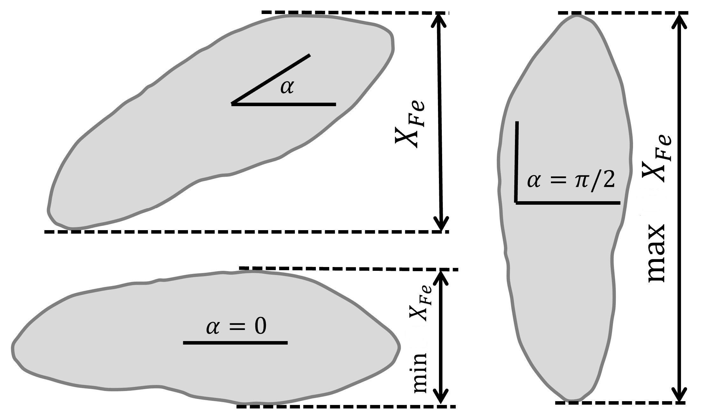
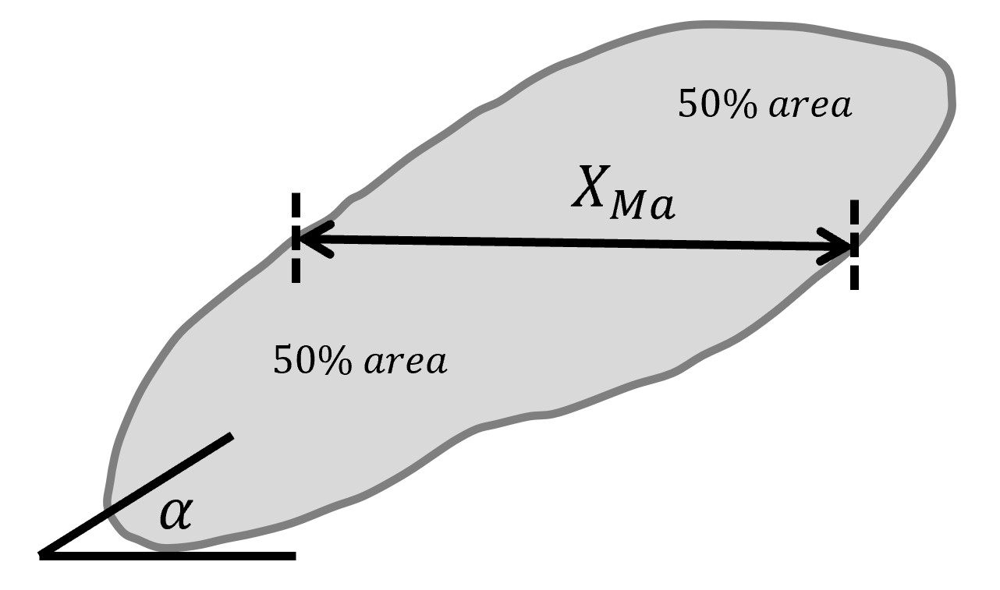
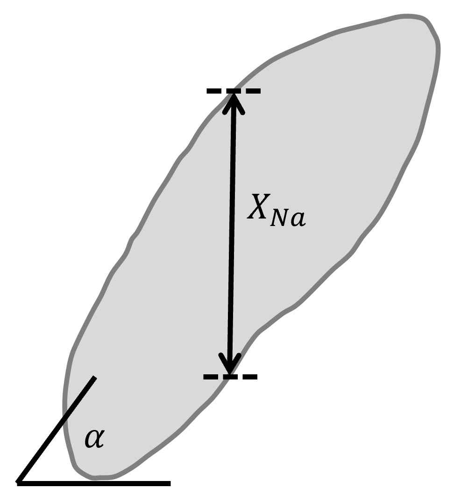

.. role:: raw-html-m2r(raw)
   :format: html

Morphology features
===================

Let :math:`A` be a set of :math:`n` pixels included in the ROI, 
:math:`A_{Xi}` and :math:`A_{Yi}` - :math:`x` and 
:math:`y` coordinates of pixel :math:`i`. Denote :math:`\mathbb{E}` the expectation operator.

| AREA_PIXELS_COUNT :math:`= S = card(A)`
| AREA_UM2 :math:`= card(A) s^2` where :math:`s` is pixel size in micrometers 
| CENTROID_X :math:`\gets c_X = \frac{1}{n} \sum_i ^n  A_{Xi}`
| CENTROID_Y :math:`\gets c_Y =  \frac{1}{n} \sum_i ^n  A_{Yi}`
| WEIGHTED_CENTROID_X :math:`\gets w_X = \frac{1}{n} \sum _i ^n  A_i (A_{Xi}-c_X)`
| WEIGHTED_CENTROID_Y :math:`\gets w_Y = \frac{1}{n} \sum _i ^n  A_i (A_{Yi}-c_Y)`
| MASS_DISPLACEMENT :math:`= \sqrt {( w_X - c_X)^2 + ( w_Y - c_Y)^2}`
| COMPACTNESS :math:`= \frac {1}{n}  {\sqrt {\mathbb {E} \left[d((A,(c_X,c_Y)))^{2}\right]}}`
| BBOX_YMIN :math:`\gets \epsilon_X = \operatorname {min}A_Y`
| BBOX_XMIN :math:`\gets \epsilon_Y = \operatorname {min}A_X`
| BBOX_HEIGHT :math:`\gets \epsilon_V = \operatorname {max}A_Y - \epsilon_Y`
| BBOX_WIDTH :math:`\gets \epsilon_H = \operatorname {max}A_X - \epsilon_X`
| ASPECT_RATIO = :math:`\begin{array}{cc} \frac{\epsilon_V}{\epsilon_H} & \epsilon_V>=\epsilon_H \frac{\epsilon_H}{\epsilon_V} & \epsilon_V<\epsilon_H \end{array}.`
| EXTENT :math:`= \frac {S}{S_{BB}}` where :math:`S_BB=\epsilon_H\epsilon_V`

Features related to ROI's contour
---------------------------------

Let :math:`C` be the set of contour pixels of ROI :math:`A`. 

| PERIMETER :math:`\gets P = card(C)`
| CIRCULARITY = :math:`\sqrt { \frac {4 \pi S}{P^2}}` where :math:`S` and :math:`P` are ROI area and perimeter (features AREA_PIXELS_COUNT and PERIMETER)
| EQUIVALENT_DIAMETER = :math:`\frac {P}{\pi}`
| EDGE_MEAN_INTENSITY :math:`\gets \mu_C =\frac{1}{card(C)}\sum_i C_i`
| EDGE_MAX_INTENSITY = :math:`\max \: \textrm C`
| EDGE_MIN_INTENSITY = :math:`\min \: \textrm C`
| EDGE_STDDEV_INTENSITY = :math:`\left[\frac{1}{card(C)}\sum_i (C_i-\mu_C)^2\right]^{\frac {1}{2}}`
| EDGE_INTEGRATEDINTENSITY = :math:`\sum _i {C_i}` 

Features related to ROI's convex hull
-------------------------------------

CONVEX_HULL_AREA = :math:`S_H= {\frac {1}{2}}{\Biggl \vert }\sum _{i=0}^{n_H-1}(x_{i}y_{i+1}-x_{i+1}y_{i}){\Biggr \vert }` where :math:`n_H` is the number of convex hull vertices, 
:math:`{(x_i,y_i)}, i=0, 1, ..., n_H-1` are Cartesian coordinates of the vertives.

SOLIDITY = :math:`\frac {S}{S_H}` where :math:`S` is ROI area (feature AREA_PIXELS_COUNT)

Features related to interpreting ROI pixels as a sampled ellipse
----------------------------------------------------------------

| MAJOR_AXIS_LENGTH :math:`= a = 4 \sqrt {\lambda_1}` where :math:`\lambda_1` is the first largest principal component 
| MINOR_AXIS_LENGTH :math:`= b = 4 \sqrt {\lambda_2}` where :math:`\lambda_2` is the second largest principal component 
| ECCENTRICITY :math:`=  \sqrt {1 - \frac {b^2} {a^2}}`
| ELONGATION :math:`=  \sqrt{\frac{\lambda_2}{\lambda_1}}`
.. I reformatted this part because it would not show up in rst. Let me know if it is not correct now.
| ORIENTATION :math:`\theta = 0` if :math:`b=0` and  :math:`a \ge c \ \frac{\pi}{2}` when :math:`b=0` and  :math:`a < c \ \arctan \frac{\lambda_1-a}{b}` if  :math:`b \ne 0`

where 

.. math:: 
  
  cov = \left(\begin{array}{cc} 
  a & b \\
  b & c
  \end{array}\right)

is the covariance matrix of ROI pixel coordinates and 

.. math::

  \lambda_1 &= \frac{a+c}{2}+\sqrt{(\frac{a-c}{2})^2 + b^2} \\
  \lambda_2 &= \frac{a+c}{2}-\sqrt{(\frac{a-c}{2})^2 + b^2}

ROUNDNESS = :math:`\frac {4 S}{\pi a b}`

Neighbor features
-----------------

NUM_NEIGHBORS :math:`\gets n_N=` the number of neighbor ROIs 

| PERCENT_TOUCHING - the ratio of ROIs situated at Euclidean distance 0 to :math:`n_N`
| CLOSEST_NEIGHBOR1_DIST - distance to ROI's closest neighbor
| CLOSEST_NEIGHBOR1_ANG - angle between the ROI centroid and its closest neighbor's centroid
| CLOSEST_NEIGHBOR2_DIST - distance to ROI's 2nd closest neighbor
| CLOSEST_NEIGHBOR2_ANG - angle between the ROI centroid and its 2nd closest neighbor's centroid
| ANG_BW_NEIGHBORS_MEAN - standard deviation of the angle between ROI's neighbors.
| ANG_BW_NEIGHBORS_STDDEV - standard deviation of the angle between ROI's neighbors.
| ANG_BW_NEIGHBORS_MODE - the histogram bin value of angle between ROI's neighbors having the highest count.

Polygonal representation features
---------------------------------

POLYGONALITY_AVE = :math:`5 (r_S + r_A)` where :math:`r_S = 1 - \left|1-\frac{\frac{P}{n_N}}{\sqrt{\frac{4S\tan \frac{\pi}{n_N}}{n_N}}} \right|` - polygonal size 
:math:`r_A = 1 - \left| 1 - \frac{S\tan \frac{\pi}{n_N}}{\frac{1}{4} \: n_N \: P^2}\right|` - polygonal area ratio, 
:math:`n_N` - number of ROI's neighbors, :math:`P` and :math:`S` - ROI's perimeter and area.

| HEXAGONALITY_AVE = :math:`\sqrt {\frac {r_{\sigma A}^2 + r_{\sigma P}^2}{2} }`
| HEXAGONALITY_STDDEV = :math:`5 (r_{HS} + r_{HP})`

References:
Nishi O, Hanasaki K. Automated determination of polygonality of corneal endothelial cells. Cornea. 1989;8(1):54-7. PMID: 2924585.

Other features
--------------

| DIAMETER_MIN_ENCLOSING_CIRCLE minimum diameter of a circle which completely covers the ROI
| DIAMETER_CIRCUMSCRIBING_CIRCLE the smallest circle centered at the ROI centroid that totally encloses the profile,
| DIAMETER_INSCRIBING_CIRCLE maximum diameter of a circle centered at the ROI centroid which fits inside the ROI

Let :math:`l_G` - geodetic length, :math:`t_G` - thickness. Assuming

.. math::

  S &= l_G t_G \\
  P &= 2(l_G+t_G)

we can express the following features as:

GEODETIC_LENGTH :math:`\gets l_G = \frac{P}{4} + \sqrt{\max \left(\frac{P^2}{16}-S, 0\right)}`
THICKNESS :math:`\gets t_G = \frac{P}{2} - l_G`

Let :math:`O=o_X,o_Y` be the ROI centroid and :math:`OC_i` - segment connecting centroid to an edge pixel :math:`i`. Then

| ROI_RADIUS_MEAN :math:`\gets \mu_r =\frac{1}{card(C)}\sum_i ||OC_i||`
| ROI_RADIUS_MAX = :math:`\max OC_i`
| ROI_RADIUS_MEDIAN - median radius :math:`OC_i`

Caliper features
----------------

Feret diameter
^^^^^^^^^^^^^^

| MIN_FERET_DIAMETER - minimum :math:`X_{Fe}`
| MAX_FERET_DIAMETER - maximum :math:`X_{Fe}`
| MIN_FERET_ANGLE - rotation angle delivering :math:`\min X_{Fe}`
| MAX_FERET_ANGLE - rotation angle delivering :math:`\max X_{Fe}`

Statistics of Feret diameter at 0-90 degree rotation angles:

| STAT_FERET_DIAM_MIN :math:`=\min X_{Fe}`
| STAT_FERET_DIAM_MAX :math:`=\max X_{Fe}`
| STAT_FERET_DIAM_MEAN :math:`=\operatorname {E} ( X_{Fe} )`
| STAT_FERET_DIAM_MEDIAN 
| STAT_FERET_DIAM_STDDEV
| STAT_FERET_DIAM_MODE

Martin diameter
^^^^^^^^^^^^^^^

Statistics of Martin diameter at 0-90 degree rotation angles:

| STAT_MARTIN_DIAM_MIN
| STAT_MARTIN_DIAM_MAX
| STAT_MARTIN_DIAM_MEAN
| STAT_MARTIN_DIAM_MEDIAN
| STAT_MARTIN_DIAM_STDDEV
| STAT_MARTIN_DIAM_MODE

Nassenstein diameter
^^^^^^^^^^^^^^^^^^^^

Statistics of Nassenstein diameter at 0-90 degree rotation angles:

|STAT_NASSENSTEIN_DIAM_MIN
| STAT_NASSENSTEIN_DIAM_MAX
| STAT_NASSENSTEIN_DIAM_MEAN
| STAT_NASSENSTEIN_DIAM_MEDIAN
| STAT_NASSENSTEIN_DIAM_STDDEV
| STAT_NASSENSTEIN_DIAM_MODE

All-chords features
^^^^^^^^^^^^^^^^^^^

.. image:: chord.jpg
  :align: center
  :width: 400

| ALLCHORDS_MAX
| ALLCHORDS_MAX_ANG
| ALLCHORDS_MIN
| ALLCHORDS_MIN_ANG
| ALLCHORDS_MEDIAN
| ALLCHORDS_MEAN
| ALLCHORDS_MODE
| ALLCHORDS_STDDEV

Max-chord features
^^^^^^^^^^^^^^^^^^

| MAXCHORDS_MAX
| MAXCHORDS_MAX_ANG
| MAXCHORDS_MIN
| MAXCHORDS_MIN_ANG
| MAXCHORDS_MEDIAN
| MAXCHORDS_MEAN
| MAXCHORDS_MODE
| MAXCHORDS_STDDEV
